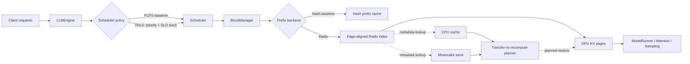

<p align="center">
  
</p>

<p align="center">
  <strong>Nano-vLLM QoS Lab</strong><br>
  SLO-aware scheduling, page-aligned Radix prefix caching, and hierarchical KV cache research on nano-vLLM
</p>

<p align="center">
  English | <a href="README_zh-CN.md">简体中文</a>
</p>

# Nano-vLLM QoS Lab

This repository is a second-development project based on
[GeeeekExplorer/nano-vllm](https://github.com/GeeeekExplorer/nano-vllm). It
keeps nano-vLLM's compact inference path while exploring a serving problem:
how should an engine coordinate request scheduling, prefix reuse, and KV cache
placement when interactive and batch requests have different latency budgets?

The current milestone implements a priority-aware latency-budget scheduler
(PALS), a page-aligned Radix prefix index, a GPU/CPU/Mooncake cache planning
model, and a Mooncake byte-store adapter. FCFS and hash-prefix policies remain
available as baselines, so every optimization can be compared instead of only
demonstrated in isolation.

> The checked-in performance numbers are deterministic control-plane simulator
> results, not GPU throughput measurements. The real remote GPU KV data path is
> explicitly listed as future work.

## Motivation

Long-context conversations, shared system prompts, agents, and RAG workloads
repeatedly prefill common token prefixes. A practical serving engine therefore
has to answer three connected questions:

1. Which request should run next when TTFT, TPOT, E2E SLOs, and priorities differ?
2. How should shared prefixes be indexed without coupling logical prefix structure to physical KV pages?
3. When a prefix exists in CPU or remote storage, is transferring it actually faster than recomputing it?

The project follows a verifiable **problem -> mechanism -> code -> metric**
workflow. Features that are still prototypes are labeled as such.

## Architecture



Solid lines are integrated into nano-vLLM's scheduling and local block
management path. Dashed lines represent the hierarchical control plane; moving
real model KV tensors between tiers is not integrated yet.

## What Is Implemented

| Area | Implementation | Status |
| --- | --- | --- |
| SLO-aware scheduling | Per-request priority, TTFT/TPOT/E2E targets, EWMA service-time estimation, urgency ordering, aging, and preemption-victim selection | Integrated |
| Request observability | Queue, TTFT, TPOT, E2E, preemption, and SLO-attainment metrics | Integrated |
| Radix prefix cache | Longest-prefix match, edge splitting, canonical concurrent inserts, reference tracking, page alignment, and LRU leaf eviction | Integrated |
| Baselines | FCFS vs. PALS and hash prefix cache vs. Radix prefix cache | Integrated |
| Hierarchical cache index | Independent GPU/CPU/Mooncake Radix indexes and residency lookup | Control-plane prototype |
| Transfer-vs-recompute | KV geometry, bandwidth/latency/congestion model, and minimum-cost source selection | Control-plane prototype |
| Mooncake adapter | Byte object and batch operations, stable KV page identity, fake-store tests, and TCP smoke script | Adapter implemented |
| Async transfer coordination | Per-key state machine, duplicate-fetch coalescing, cancellation isolation, retryable failures, and ordered Fetch/Write/Evict operations | Control-plane prototype |
| KV page data plane | Versioned/checksummed envelope, layout compatibility checks, pinned CPU staging, and physical Tensor page export/restore | Rank-local primitive implemented |
| Automatic remote restore | Scheduler blocking/wakeup, BlockManager registration, transfer/compute overlap, and TP-rank orchestration | Roadmap |

## Core Design

### 1. Priority-Aware Latency-Budget Scheduling

Each request can supply a priority and three optional service-level objectives:

```python
from nanovllm import LLM, RequestQoS, SamplingParams

llm = LLM(
    "/path/to/model",
    scheduling_policy="pals",
    prefix_cache_backend="radix",
    enforce_eager=True,
)

outputs = llm.generate(
    ["Summarize this incident report."],
    SamplingParams(temperature=0.6, max_tokens=128),
    request_qos=RequestQoS(
        priority=4,
        ttft_slo_ms=100.0,
        tpot_slo_ms=20.0,
        e2e_slo_ms=1000.0,
        request_class="interactive",
    ),
)

print(outputs[0]["metrics"])
print(llm.get_scheduler_metrics())
```

PALS estimates the remaining prefill/decode service time and computes request
urgency from the remaining latency budget:

```text
slack = SLO budget - elapsed time - estimated remaining service time
score = slack - priority credit - aging credit
```

The request with the smallest score is most urgent. The same policy also picks
the least urgent running request as a preemption victim when KV pages are scarce.

### 2. Page-Aligned Radix Prefix Cache

The original chained block hash is retained as a baseline. The Radix backend
adds an explicit hierarchy over complete KV pages:

```text
request tokens -> page keys -> longest Radix match -> physical block IDs
                                                -> prefill only the suffix
```

The Radix tree stores prefix metadata and block handles; the `BlockManager`
still owns physical GPU KV pages. This separation keeps prefix splitting and
sharing independent from tensor allocation.

### 3. Hierarchical KV Planning

The planner compares local recomputation with every available cache tier. For a
candidate tier:

```text
T_restore = fixed latency + KV bytes / effective bandwidth
            + prefill time for the uncached suffix
T_recompute = prefill time from the local cached boundary
decision = argmin(T_recompute, T_cpu_restore, T_mooncake_restore)
```

This makes **remote hit != always restore**. Short prefixes or congested links
can be cheaper to recompute, while long prefixes can justify remote transfer.

### 4. Asynchronous Transfer State Machine

`AsyncKVTransferCoordinator` tracks each remote object through `ABSENT`,
`FETCHING`, `RESIDENT`, `WRITING`, `EVICTING`, and `FAILED`. Concurrent readers
join one backend fetch, and `asyncio.shield` prevents a cancelled request from
cancelling work shared by other requests.

Every key also has a monotonically increasing generation and an ordered I/O
tail. If eviction supersedes an in-flight fetch, the stale generation cannot
publish its payload, and the backend remove executes after the read. Failed
operations become observable and can be retried instead of leaving the object
stuck in a transitional state.

### 5. Versioned KV Page Data Plane

A physical block spans K/V and every model layer. Because fixing the block axis
does not produce contiguous storage across layers, `TorchKVPageIO` first packs
the page into a contiguous pinned CPU buffer. The versioned envelope carries
model identity, TP rank, logical page index, Tensor layout, raw bytes, and a
BLAKE2b checksum.

`ModelRunner` exposes rank-local export/import primitives. Import validates the
consumer identity and actual KV cache layout before copying bytes into a newly
allocated physical block. The current primitive synchronizes at the API
boundary; scheduler-driven asynchronous restore remains future work.

## Reproduce the Control-Plane Experiments

The control-plane suite does not require model weights or a CUDA GPU:

```bash
python -m pip install -r requirements-control.txt
python -m pytest -q

python -m benchmarks.benchmark_qos_scheduler \
  --output-json benchmarks/results/qos_simulation.json

python -m benchmarks.benchmark_tiered_cache \
  --output-json benchmarks/results/tiered_cache_simulation.json
```

With a compatible PyTorch/CUDA environment, validate a real synthetic BF16 KV
Tensor page round trip:

```bash
python -m scripts.kv_page_roundtrip --device cuda --dtype bfloat16
```

### Deterministic Simulator Results

| Experiment | Baseline | Proposed policy | Result |
| --- | ---: | ---: | ---: |
| Interactive TTFT p95 | FCFS: 221.08 ms | PALS: 10.61 ms | 95.2% lower |
| Batch E2E SLO attainment | FCFS: 100% | PALS: 100% | Preserved |
| Simulated makespan | FCFS: 445.42 ms | PALS: 542.62 ms | 21.8% higher |
| Average cache access cost | Local recompute: 107.20 ms | Cost-aware: 95.96 ms | 10.5% lower |
| Average cache access cost | Always restore: 168.93 ms | Cost-aware: 95.96 ms | 43.2% lower |

The first workload intentionally mixes latency-sensitive interactive requests
with throughput-oriented batch requests. The result illustrates a policy
trade-off: PALS protects interactive TTFT and batch SLO attainment at the cost
of a longer makespan. It does **not** claim a 95.2% improvement on real hardware.

Raw results are stored in
[`benchmarks/results`](benchmarks/results), and both benchmark scripts use fixed
workloads so regressions can be tested in CI.

## Installation and Original Inference Path

For full model inference, follow the upstream environment requirements. A
typical editable installation is:

```bash
git clone <this-repository-url>
cd nano-vllm-qos
python -m pip install -e .
```

```python
from nanovllm import LLM, SamplingParams

llm = LLM("/path/to/Qwen3-0.6B", enforce_eager=True)
params = SamplingParams(temperature=0.6, max_tokens=256)
outputs = llm.generate(["Hello, Nano-vLLM."], params)
print(outputs[0]["text"])
```

## Optional Mooncake Smoke Test

On a supported Linux environment, install the optional dependency and validate
the adapter before integrating GPU KV tensors:

```bash
python -m pip install -e ".[mooncake]"
mooncake_master
python -m scripts.mooncake_smoke --protocol tcp
```

The adapter is covered by fake-store unit tests on CPU. A real Mooncake process,
RDMA, and GPU tensor movement have not been validated on Windows.

## Repository Guide

| Path | Purpose |
| --- | --- |
| `nanovllm/engine/qos.py` | Request QoS model, metrics, service-time estimator, FCFS/PALS policies |
| `nanovllm/engine/scheduler.py` | Policy integration with waiting/running queues and preemption |
| `nanovllm/engine/radix_cache.py` | Page-aligned Radix prefix metadata |
| `nanovllm/engine/block_manager.py` | Hash/Radix backend integration and physical block ownership |
| `nanovllm/engine/hierarchical_cache.py` | Tier indexes and transfer-vs-recompute planner |
| `nanovllm/engine/storage_backend.py` | In-memory and Mooncake KV object adapters |
| `nanovllm/engine/transfer_coordinator.py` | Async KV state machine, request coalescing, and per-key I/O ordering |
| `nanovllm/engine/kv_page.py` | Stable page envelope, Torch page movement, and async storage bridge |
| `benchmarks/` | Deterministic scheduler and tiered-cache simulations |
| `tests/` | Control-plane unit, race, benchmark, and adapter tests |
| `docs/` | Chinese design notes and paper reading list |

## Current Boundary and Roadmap

The project deliberately separates what is already testable from the end-state
design.

- [x] FCFS/PALS pluggable scheduler and per-request SLO metrics
- [x] Hash/Radix pluggable prefix cache
- [x] Hierarchical metadata indexes and transfer cost model
- [x] Mooncake object adapter and deterministic benchmarks
- [x] Deduplicated asynchronous fetch/write/evict state machine
- [x] Versioned real K/V page serialization and synchronous CPU <-> GPU restore primitive
- [ ] Overlap KV transfer with inference by using dedicated CUDA streams and events
- [ ] Connect remote-fetch completion to scheduler wakeup and cancellation
- [ ] Run GPU baselines and ablations with fixed model, hardware, request rate, and prompt distribution
- [ ] Report TTFT/TPOT p50/p95/p99, SLO goodput, cache hit rate, transfer bytes, and recomputed tokens

No resume or performance claim should replace the simulator numbers with GPU
numbers until those measurements are reproduced on documented hardware.

## Documentation

- [QoS scheduler design (Chinese)](docs/qos_scheduler_zh.md)
- [Hierarchical Radix and Mooncake design (Chinese)](docs/hierarchical_radix_mooncake_zh.md)
- [Asynchronous KV transfer state machine (Chinese)](docs/async_kv_transfer_zh.md)
- [KV page data plane and stable envelope (Chinese)](docs/kv_page_data_plane_zh.md)
- [Related papers](docs/papers.md)

## Acknowledgements

This project is derived from
[GeeeekExplorer/nano-vllm](https://github.com/GeeeekExplorer/nano-vllm) and
retains its MIT license. The upstream project provides the compact inference
engine, Paged KV cache, continuous batching, CUDA graph, and model execution
foundation used by this research prototype.
