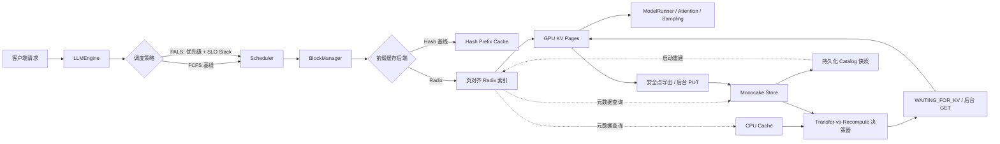

<p align="center">
  
</p>

<p align="center">
  <strong>Nano-vLLM QoS Lab</strong><br>
  基于 nano-vLLM 的 SLO 感知调度、页对齐 Radix 前缀缓存与分层 KV Cache 研究
</p>

<p align="center">
  <a href="README.md">English</a> | 简体中文
</p>

# Nano-vLLM QoS Lab

本仓库是基于
[GeeeekExplorer/nano-vllm](https://github.com/GeeeekExplorer/nano-vllm)
进行的推理引擎二次开发项目。项目保留 nano-vLLM 简洁的推理链路，重点探索一个
LLM Serving 问题：当在线请求和批处理请求具有不同的优先级与延迟预算时，推理引擎应该如何协同请求调度、前缀复用与 KV Cache 分层放置？

当前里程碑已经实现优先级与延迟预算感知调度器 PALS、页对齐 Radix 前缀索引、
GPU/CPU/Mooncake 分层缓存决策模型、版本化 KV Page 数据面，以及 TP=1 下的自动远端
恢复、自动远端写回和可重启恢复的持久化 Catalog。原有 FCFS 与 Hash Prefix Cache
作为基线保留，便于对每项优化进行可复现的对比。

> 仓库中的性能数字来自确定性的控制面模拟器，不是 GPU 实机吞吐数据。GPU Page
> 往返正确性已经单独验证，真实 Mooncake 端到端性能仍属于后续工作。

## 项目背景

长上下文对话、共享 System Prompt、Agent 与 RAG 工作负载中存在大量重复 Token
前缀。在线推理引擎需要同时回答三个互相关联的问题：

1. 当请求的 TTFT、TPOT、E2E SLO 和优先级不同时，下一个应该运行谁？
2. 如何组织共享前缀，同时避免把逻辑前缀结构与物理 KV Page 绑定在一起？
3. 当 CPU 或远端已经存在某段 KV Cache 时，传输一定比重新 Prefill 更快吗？

项目按照 **问题 -> 方案 -> 代码落点 -> 可验证指标** 的方式推进。尚处于原型阶段的
能力会明确标注，不把设计目标写成已经完成的结果。

## 系统架构



TP=1 的远端恢复路径已经从 Prefix Lookup 接到 GPU Page Import 与 Scheduler 唤醒。
新完成 Page 的自动 Write-Back 和单写者 Catalog 重启恢复也已接入。多实例一致性、
传输/计算重叠和 TP 多 Rank 恢复仍属于后续工作。

## 已实现内容

| 模块 | 实现内容 | 当前状态 |
| --- | --- | --- |
| SLO 感知调度 | 请求优先级、TTFT/TPOT/E2E 目标、EWMA 执行时间估计、紧迫度排序、老化与抢占对象选择 | 已接入推理调度器 |
| 请求可观测性 | Queue、TTFT、TPOT、E2E、抢占次数与 SLO 达成率 | 已接入 |
| Radix 前缀缓存 | Longest Prefix Match、边分裂、并发插入规范化、引用管理、Page 对齐与 LRU 叶节点驱逐 | 已接入 BlockManager |
| 对比基线 | FCFS vs. PALS，Hash Prefix Cache vs. Radix Prefix Cache | 已实现 |
| 分层缓存索引 | GPU/CPU/Mooncake 独立 Radix 索引与驻留位置查询 | 控制面原型 |
| Transfer-vs-Recompute | KV 几何尺寸、带宽/时延/拥塞模型与最低成本来源选择 | 控制面原型 |
| Mooncake 适配器 | 单对象与批量接口、稳定 KV Page 标识、Fake Store 测试与 TCP 冒烟脚本 | 适配层已实现 |
| 异步传输协调 | Key 级状态机、重复 Fetch 合并、取消隔离、失败重试与 Fetch/Write/Evict 有序执行 | 控制面原型 |
| KV Page 数据面 | 版本化/带校验 Envelope、布局兼容检查、Pinned CPU Staging 与真实 Tensor Page 导出/恢复 | Rank-Local 原语已实现 |
| 自动远端恢复 | `WAITING_FOR_KV`、Block 预留、后台 GET、主线程 GPU Import、Radix 原子提交、唤醒与 Prefill 回退 | TP=1 已接入 |
| 自动远端写回 | 安全点 GPU Export、后台 PUT、Page 级写入合并、失败隔离与 Remote Catalog 原子发布 | TP=1 已接入 |
| Remote Catalog 持久化 | 版本化/带校验快照、身份隔离对象 Key、异步保存、启动 Radix 重建与损坏快照回退 | 单写者重启恢复已接入 |

## 核心设计

### 1. 面向延迟预算的优先级调度

每个请求可以声明优先级与三个可选 SLO：

```python
from nanovllm import LLM, RequestQoS, SamplingParams

llm = LLM(
    "/path/to/model",
    scheduling_policy="pals",
    prefix_cache_backend="radix",
    enforce_eager=True,
)

outputs = llm.generate(
    ["请总结这份故障报告。"],
    SamplingParams(temperature=0.6, max_tokens=128),
    request_qos=RequestQoS(
        priority=4,
        ttft_slo_ms=100.0,
        tpot_slo_ms=20.0,
        e2e_slo_ms=1000.0,
        request_class="interactive",
    ),
)

print(outputs[0]["metrics"])
print(llm.get_scheduler_metrics())
```

PALS 估算剩余 Prefill/Decode 服务时间，并根据剩余延迟预算计算请求紧迫度：

```text
slack = SLO 预算 - 已用时间 - 预计剩余服务时间
score = slack - 优先级补偿 - 等待老化补偿
```

`score` 越小，请求越紧迫。当 KV Page 不足时，同一策略会选择最不紧迫的 Running
请求作为抢占对象。

### 2. Page-Aligned Radix Prefix Cache

项目保留原有链式 Block Hash 作为基线，并增加显式的 Radix 层次结构：

```text
请求 Token -> Page Key -> Radix 最长前缀匹配 -> 物理 Block ID
                                            -> 仅 Prefill 剩余后缀
```

Radix Tree 只保存前缀元数据和 Block Handle，物理 GPU KV Page 仍由
`BlockManager` 管理。这样 Prefix Split 与共享逻辑不会侵入 Tensor 分配层。

### 3. 分层 KV Cache 决策

决策器会把本地重计算与每个可用层级进行比较：

```text
T_restore = 固定时延 + KV 字节数 / 有效带宽
            + 未命中后缀的 Prefill 时间
T_recompute = 从本地命中边界开始的 Prefill 时间
decision = argmin(T_recompute, T_cpu_restore, T_mooncake_restore)
```

因此 **Remote Hit 不等于 Always Restore**。短前缀或拥塞链路可能更适合重计算，长前缀
才更可能抵消远端传输开销。

### 4. 异步传输状态机

`AsyncKVTransferCoordinator` 为每个远端对象维护 `ABSENT`、`FETCHING`、
`RESIDENT`、`WRITING`、`EVICTING` 与 `FAILED` 状态。多个并发读取者只会触发一次
后端 Fetch；通过 `asyncio.shield` 隔离请求取消，某个请求退出不会取消其他请求仍在等待的共享操作。

每个 Key 还维护单调递增的 Generation 和有序 I/O Tail。当 Evict 覆盖正在执行的 Fetch
时，旧 Generation 无法重新发布过期 Payload，同时 Backend Remove 会排在 Read 之后执行。
失败状态可观测、可重试，避免对象永久卡在中间状态。

### 5. 版本化 KV Page 数据面

一个物理 Block 跨越 K/V 和全部模型 Layer。固定 Block 维后，跨 Layer 的数据不保证连续，
因此 `TorchKVPageIO` 会先把 Page 打包到连续的 Pinned CPU Buffer。版本化 Envelope 保存
模型身份、TP Rank、逻辑 Page Index、Tensor Layout、原始字节和 BLAKE2b Checksum。

`ModelRunner` 已提供 Rank-Local 导出/导入原语。恢复前会校验消费端身份与当前 KV Cache
实际 Layout，再把字节写入新分配的 Physical Block。当前 API 在返回前同步；下一节介绍
Scheduler 编排，传输与计算重叠仍属于后续工作。

### 6. Scheduler 驱动的远端恢复

配置 `kv_storage_backend` 后，当 Remote Prefix 长于 Local Match 时，系统先通过
Transfer-vs-Recompute Cost Model 决策。接受恢复的请求会预留 Physical Block 并进入
`WAITING_FOR_KV`。Backend GET 在独立 asyncio Loop 中执行，CUDA Import 保持在主推理线程。

只有全部 Page 通过校验并写入 GPU 后，`BlockManager` 才会把 Prefix 原子发布到 Local
Radix 并唤醒请求。缺页或损坏会释放全部预留并回退本地 Prefill；并发请求通过 Transfer
Coordinator 共享 Backend Read。

### 7. 自动远端写回

`ModelRunner.run()` 返回后，新完成的 KV Page 已包含有效数据；但紧接着执行的
`Scheduler.postprocess()` 可能结束请求并释放 Physical Block。因此，引擎把 Page Export
放在这两个操作之间：CUDA Page 打包留在主推理线程，Backend PUT 交给后台 asyncio Loop。

多个请求写入同一个 Page 时会共享同一个在途 Future。只有一个 Prefix 的所有必要 PUT
都成功后，系统才把它发布到 `RemotePrefixCatalog`。导出或存储失败只会记录为缓存优化
失败，不会中断 Token 生成；引擎退出时会刷新仍在执行的写回批次。

### 8. Catalog 持久化与重启恢复

只有 KV Page 对象还不够：服务重启后，新进程还需要知道“哪段 Token Prefix 对应哪些远端
Page”。系统为每个模型身份和 TP Rank 生成稳定 Catalog Key。快照只保存逻辑 Token Block
路径与 Remote Page Descriptor，不保存进程内 Radix Handle 或物理 GPU Block ID。

Page PUT 成功后，Catalog 快照在后台按顺序保存；正常退出时强制刷新。新服务启动后会校验
Schema、Version、模型身份和 Checksum，再通过规范化 Insert 路径重建 Radix。快照缺失或
损坏时退化为空 Catalog，不影响本地推理。当前 Whole-Snapshot 协议假设只有一个写者；
多个服务实例并发更新还需要 Backend CAS 或事务元数据支持。

## 复现控制面实验

控制面测试不需要模型权重和 CUDA GPU：

```bash
python -m pip install -r requirements-control.txt
python -m pytest -q

python -m benchmarks.benchmark_qos_scheduler \
  --output-json benchmarks/results/qos_simulation.json

python -m benchmarks.benchmark_tiered_cache \
  --output-json benchmarks/results/tiered_cache_simulation.json
```

在符合版本要求的 PyTorch/CUDA 环境中，可以验证真实 BF16 KV Tensor Page 往返：

```bash
python -m scripts.kv_page_roundtrip --device cuda --dtype bfloat16
```

### 确定性模拟结果

| 实验 | 基线 | 本项目策略 | 结果 |
| --- | ---: | ---: | ---: |
| 交互请求 TTFT p95 | FCFS: 221.08 ms | PALS: 10.61 ms | 降低 95.2% |
| Batch E2E SLO 达成率 | FCFS: 100% | PALS: 100% | 保持不变 |
| 模拟 Makespan | FCFS: 445.42 ms | PALS: 542.62 ms | 增加 21.8% |
| 平均缓存访问成本 | 本地重计算: 107.20 ms | Cost-aware: 95.96 ms | 降低 10.5% |
| 平均缓存访问成本 | Always Restore: 168.93 ms | Cost-aware: 95.96 ms | 降低 43.2% |

第一个工作负载有意混合低延迟交互请求与吞吐优先的 Batch 请求。结果体现了明确的策略
权衡：PALS 以更长的 Makespan 为代价，保护交互请求 TTFT，同时保持 Batch E2E SLO。
这里的 95.2% **不是实机性能提升结论**。

原始结果保存在 [`benchmarks/results`](benchmarks/results)。两个 Benchmark 都使用固定
工作负载，因此可以在 CI 中检测调度与缓存策略回归。

## 安装与原始推理链路

完整模型推理需要满足上游项目的 CUDA 环境要求。典型的本地开发安装方式为：

```bash
git clone <this-repository-url>
cd nano-vllm-qos
python -m pip install -e .
```

```python
from nanovllm import LLM, SamplingParams

llm = LLM("/path/to/Qwen3-0.6B", enforce_eager=True)
params = SamplingParams(temperature=0.6, max_tokens=256)
outputs = llm.generate(["你好，Nano-vLLM。"], params)
print(outputs[0]["text"])
```

## OpenAI 兼容服务与对话前端

安装可选服务依赖后，可以让一个 API 进程独占一张 GPU：

```bash
python -m pip install -e ".[serve]"
python -m nanovllm.serve \
  --model /path/to/Qwen3-0.6B \
  --served-model-name qwen3-0.6b \
  --scheduling-policy pals \
  --prefix-cache-backend radix \
  --host 127.0.0.1 \
  --port 8000
```

浏览器打开 `http://127.0.0.1:8000/` 即可使用流式对话界面。没有模型权重或 CUDA
GPU 时，可以启动带有明确标识的开发后端来检查 API 和响应式前端：

```bash
python -m pip install -r requirements-control.txt
python -m nanovllm.serve --mock --port 8010
```

当前实现支持纯文本 `POST /v1/chat/completions`、SSE 流式 Chunk、可选的最终 Usage
Chunk、`GET /v1/models` 和 OpenAI 风格错误结构；同时增加 `priority`、
`request_class`、`ttft_slo_ms`、`tpot_slo_ms`、`e2e_slo_ms` 等 nano-vLLM QoS
扩展字段。传入 `--api-key` 可以保护 `/v1/*` 路由。协议结构参考官方
[Chat Completions API 文档](https://developers.openai.com/api/reference/resources/chat)。

独立推理 Worker 负责创建引擎并独占全部 CUDA 调用，FastAPI 只异步处理 HTTP。
每轮 Engine Step 前接纳新请求以保留 Continuous Batching，每次 Decode 后发布 Token
事件；客户端断开时进入 Scheduler 取消路径并释放请求持有的 KV Block。完整流程见
[OpenAI 兼容服务设计解析](docs/openai_serving_zh.md)。

## 可选 Mooncake 冒烟测试

在受支持的 Linux 环境中，可先验证 Mooncake 适配器，再运行端到端远端恢复：

```bash
python -m pip install -e ".[mooncake]"
mooncake_master
python -m scripts.mooncake_smoke --protocol tcp
```

当前适配器已通过 CPU Fake Store 单测。Windows 环境尚未验证真实 Mooncake 进程、
RDMA 和 GPU Tensor 数据搬运。

## 代码导览

| 路径 | 作用 |
| --- | --- |
| `nanovllm/engine/qos.py` | 请求 QoS、指标、服务时间估计与 FCFS/PALS 策略 |
| `nanovllm/engine/scheduler.py` | 调度策略与 Waiting/Running 队列、抢占逻辑的集成 |
| `nanovllm/engine/radix_cache.py` | Page-Aligned Radix 前缀元数据 |
| `nanovllm/engine/block_manager.py` | Hash/Radix 后端接入与物理 Block 所有权 |
| `nanovllm/engine/hierarchical_cache.py` | 分层索引与 Transfer-vs-Recompute 决策器 |
| `nanovllm/engine/storage_backend.py` | In-Memory 与 Mooncake KV 对象适配器 |
| `nanovllm/engine/transfer_coordinator.py` | 异步 KV 状态机、并发请求合并与 Key 级 I/O 排序 |
| `nanovllm/engine/kv_page.py` | 稳定 Page Envelope、Torch Page 搬运与异步存储桥接 |
| `nanovllm/engine/remote_catalog.py` | 版本化持久化 Catalog 快照格式与编解码 |
| `nanovllm/engine/remote_restore.py` | Remote Prefix Catalog、后台 I/O 服务与 Restore/Write-Back Batch |
| `nanovllm/serve/` | OpenAI 兼容协议、推理 Worker、Mock 后端与对话前端 |
| `benchmarks/` | 确定性的调度与分层缓存模拟器 |
| `tests/` | 控制面、竞争条件、Benchmark 与存储适配器测试 |
| `docs/` | 中文设计文档与论文阅读清单 |

## 当前边界与 Roadmap

本项目有意区分“已经可验证的代码”和“最终设计目标”：

- [x] FCFS/PALS 可插拔调度器与请求级 SLO 指标
- [x] Hash/Radix 可插拔前缀缓存
- [x] 分层元数据索引与传输成本模型
- [x] Mooncake 对象适配器与确定性 Benchmark
- [x] 可合并重复请求的异步 Fetch/Write/Evict 状态机
- [x] 版本化真实 K/V Page 序列化与同步 CPU <-> GPU 恢复原语
- [x] TP=1 下的 Remote Fetch 完成、BlockManager 原子注册、Scheduler 唤醒、取消隔离与 Prefill 回退
- [x] TP=1 下的安全点自动 Remote Write-Back、重复 PUT 合并、失败隔离与 Catalog 原子发布
- [x] 版本化 Catalog 持久化快照与单写者跨进程重启重建
- [x] OpenAI 兼容纯文本对话 API、真实 Token 流、请求取消、可选 API Key 与响应式指标前端
- [ ] 使用独立 CUDA Stream/Event 让 KV 传输与推理计算重叠
- [ ] 基于 Backend CAS 或事务元数据的多服务实例 Catalog 一致性
- [ ] Tensor Parallel Shard 恢复与跨 Rank 完成同步
- [ ] 在统一模型、硬件、请求到达率和 Prompt 分布下完成 GPU Baseline 与 Ablation
- [ ] 报告 TTFT/TPOT p50/p95/p99、SLO Goodput、各级命中率、传输字节数和重计算 Token

在统一硬件上完成复现之前，简历和项目介绍不应把模拟数据替换成 GPU 实测结论。

## 为什么这是二次开发而不是简单复现

本项目不是重新运行 nano-vLLM 示例，而是在读清真实执行链路后逐层修改系统策略：

```text
Hash Prefix      -> Page-Aligned Radix Prefix
GPU-only pressure -> GPU/CPU/Mooncake 分层规划
Remote hit       -> Transfer-vs-Recompute 动态决策
FCFS             -> Priority + SLO Slack 调度
```

这条主线对应了可以定位到源码、单测和 Benchmark 的实际改动，也保留了基线用于回答
“为什么这样设计”和“优化代价是什么”。

## 相关文档

- [QoS 调度器设计](docs/qos_scheduler_zh.md)
- [分层 Radix 与 Mooncake 设计](docs/hierarchical_radix_mooncake_zh.md)
- [异步 KV 传输状态机设计](docs/async_kv_transfer_zh.md)
- [KV Page 数据面与稳定 Envelope](docs/kv_page_data_plane_zh.md)
- [Remote KV Restore 与 Scheduler 唤醒闭环](docs/remote_restore_scheduler_zh.md)
- [自动 Remote Write-Back 设计](docs/remote_writeback_zh.md)
- [Remote Catalog 持久化与重启恢复](docs/persistent_catalog_zh.md)
- [OpenAI 兼容服务与流式前端设计](docs/openai_serving_zh.md)
- [相关论文](docs/papers.md)

## 致谢

本项目派生自 [GeeeekExplorer/nano-vllm](https://github.com/GeeeekExplorer/nano-vllm)，
并保留其 MIT License。上游项目提供了精简的推理引擎、Paged KV Cache、Continuous
Batching、CUDA Graph 与模型执行基础，本仓库在此基础上开展调度与缓存系统实验。
