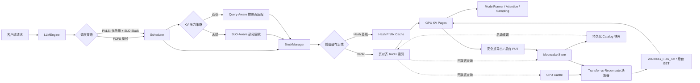

<p align="center">
  
</p>

<p align="center">
  <strong>Nano-vLLM QoS Lab</strong><br>
  基于 nano-vLLM 的 SLO 感知调度、Query-Aware KV 压缩、Radix 前缀缓存与分层 KV 研究
</p>

<p align="center">
  <a href="README.md">English</a> | 简体中文
</p>

# Nano-vLLM QoS Lab

> 评测更新：历史 +70.2% 输出吞吐结果每轮仅 8 个请求，属于探索性实验。
> 新版加入相同保留页预算、每策略 216 题合成检索，以及持续到达压测。
> 执行方法与结论边界见[扩大评测协议](docs/validation_protocol_zh.md)。
> [独立样本验证](docs/final_validation_zh.md)已扩大到每策略 432 题：相同 5 页预算下，
> Query-Aware 准确率 70.6%，固定窗口 27.1%，不压缩 74.1%。累计丢弃 58.3% KV Token
> 不等于 GPU 峰值显存下降 58.3%；性能结论与失败请求另行记录。
> 12 轮持续压测共发出 9012 请求，成功 8797、超时 215，尚不能证明稳定吞吐收益。
> 最新[18 轮五分钟设备上下文消融](docs/device_context_sustained_zh.md)共发出 10,818 请求，
> 10,817 成功，基线有 1 次连接超时。3 rps 下输出吞吐均值增加 25.3%，但两种模式均积压；
> scoped 交互 SLO 达标率均值为 52.6%，不代表稳定承载 3 rps，完整区间和失败样本均保留。
> 当前 WSL 全量回归测试 213 项通过。另完成[指标热路径对照](docs/metrics_summary_optimization_zh.md)：
> 各模式三轮、共 3606 请求全部成功，历史汇总耗时下降 92.6%，但未证实端到端吞吐收益。
> 新增[KV 抢占追踪与驻留准入上限](docs/kv_preemption_diagnosis_zh.md)，区分每步批次大小与
> KV 驻留请求数。准入上限仍为默认关闭的实验选项，带追踪的诊断数据不能用于宣称加速。
> 单轮诊断中，驻留上限 8 消除了回收，但交互延迟恶化；保留该负面结果，不作为优化收益宣传。
> 后续[优先级页预算实验](docs/kv_page_admission_zh.md)同样默认关闭：六轮压力测试减少了重算，
> 但尾延迟与吞吐均值恶化。另补齐部分 Prefill 与自我抢占后的进度保障，并通过 GPU 冒烟验证。
> [执行阶段诊断](docs/engine_phase_profile_zh.md)进一步定位到残留的全局默认设备分派上下文，
> 已改为初始化期间限定 CUDA 作用域、退出恢复调用者状态，并显式指定 pinned 输入位于 CPU。
> 本机 Nsight 仅采集到 API/NVTX 数据，没有 GPU Kernel 事件，不据此宣称 GPU 利用率或算子耗时占比。
> 随后完成[设备上下文短时在线消融](docs/device_context_online_zh.md)：六轮交替对照，1086 请求全部成功，
> 输出吞吐均值提升 21.1%。该结果限定于单档负载、每轮 60 秒到达窗口，不代表持续容量或上游对比加速。

本仓库是基于
[GeeeekExplorer/nano-vllm](https://github.com/GeeeekExplorer/nano-vllm)
进行的推理引擎二次开发项目。项目保留 nano-vLLM 简洁的推理链路，重点探索一个
LLM Serving 问题：当在线请求和批处理请求具有不同的优先级与延迟预算时，推理引擎应该如何协同请求调度、前缀复用与 KV Cache 分层放置？

当前里程碑已经实现优先级与延迟预算感知调度器 PALS、页对齐 Radix 前缀索引、
GPU/CPU/Mooncake 分层缓存决策模型、版本化 KV Page 数据面，以及 TP=1 下的自动远端
恢复、自动远端写回和可重启恢复的持久化 Catalog。在此基础上，本仓库新增了无损的
SLO-Aware 部分 KV 回收，以及按 Query 相关性保留历史页的近似 KV 压缩。原有 FCFS、
Hash Prefix Cache、全量重计算和不压缩策略均作为基线保留。

> 调度、回收、压缩和质量结论均包含 RTX 4060 Laptop GPU + Qwen3-0.6B 实机数据；
> Mooncake 使用 WSL2 单机 TCP。每项结论会区分确定性模拟、实机性能和小规模质量探针，
> 不把单机结果外推为 RDMA、多机或通用模型质量结论。

## 项目背景

长上下文对话、共享 System Prompt、Agent 与 RAG 工作负载中存在大量重复 Token
前缀。在线推理引擎需要同时回答三个互相关联的问题：

1. 当请求的 TTFT、TPOT、E2E SLO 和优先级不同时，下一个应该运行谁？
2. 如何组织共享前缀，同时避免把逻辑前缀结构与物理 KV Page 绑定在一起？
3. 当 CPU 或远端已经存在某段 KV Cache 时，传输一定比重新 Prefill 更快吗？

项目按照 **问题 -> 方案 -> 代码落点 -> 可验证指标** 的方式推进。尚处于原型阶段的
能力会明确标注，不把设计目标写成已经完成的结果。

## 系统架构



TP=1 的远端恢复路径已经从 Prefix Lookup 接到 GPU Page Import 与 Scheduler 唤醒。
新完成 Page 的自动 Write-Back 和单写者 Catalog 重启恢复也已接入。多实例一致性、
传输/计算重叠和 TP 多 Rank 恢复仍属于后续工作。

## 已实现内容

| 模块 | 实现内容 | 当前状态 |
| --- | --- | --- |
| SLO 感知调度 | 请求优先级、TTFT/TPOT/E2E 目标、EWMA 执行时间估计、紧迫度排序、老化与抢占对象选择 | 已接入推理调度器 |
| 请求可观测性 | Queue、TTFT、TPOT、E2E、抢占与 SLO；缓存不变的历史摘要，实时刷新队列和 KV 状态 | 已接入 |
| SLO-Aware KV 回收 | 按请求紧迫度保留连续前缀、释放后缀、Radix 后缀重挂接与无进展全量回收兜底 | 无损路径，已完成实机对照 |
| Query-Aware KV 压缩 | 保留 Attention Sink、与尾部 Query 稀有 Token 重合的历史页和 Recent Window；逻辑/物理长度解耦 | 近似路径，已完成实机性能与质量探针 |
| Radix 前缀缓存 | Longest Prefix Match、边分裂、并发插入规范化、引用管理、Page 对齐与 LRU 叶节点驱逐 | 已接入 BlockManager |
| 对比基线 | FCFS vs. PALS，Hash Prefix Cache vs. Radix Prefix Cache | 已实现 |
| 分层缓存索引 | GPU/CPU/Mooncake 独立 Radix 索引与驻留位置查询 | 控制面原型 |
| Transfer-vs-Recompute | KV 几何尺寸、带宽/时延/拥塞模型与最低成本来源选择 | 控制面原型 |
| Mooncake 适配器 | 单对象与批量接口、稳定 KV Page 标识、Fake Store 测试与 TCP 冒烟脚本 | 适配层已实现 |
| 异步传输协调 | Key 级状态机、重复 Fetch 合并、取消隔离、失败重试与 Fetch/Write/Evict 有序执行 | 控制面原型 |
| KV Page 数据面 | 版本化/带校验 Envelope、布局兼容检查、Pinned CPU Staging 与真实 Tensor Page 导出/恢复 | Rank-Local 原语已实现 |
| 自动远端恢复 | `WAITING_FOR_KV`、Block 预留、后台 GET、主线程 GPU Import、Radix 原子提交、唤醒与 Prefill 回退 | TP=1 已接入 |
| 自动远端写回 | 安全点 GPU Export、后台 PUT、Page 级写入合并、失败隔离与 Remote Catalog 原子发布 | TP=1 已接入 |
| Remote Catalog 持久化 | 版本化/带校验快照、身份隔离对象 Key、异步保存、启动 Radix 重建与损坏快照回退 | 单写者重启恢复已接入 |

## 核心设计

### 1. 面向延迟预算的优先级调度

每个请求可以声明优先级与三个可选 SLO：

```python
from nanovllm import LLM, RequestQoS, SamplingParams

llm = LLM(
    "/path/to/model",
    scheduling_policy="pals",
    prefix_cache_backend="radix",
    enforce_eager=True,
)

outputs = llm.generate(
    ["请总结这份故障报告。"],
    SamplingParams(temperature=0.6, max_tokens=128),
    request_qos=RequestQoS(
        priority=4,
        ttft_slo_ms=100.0,
        tpot_slo_ms=20.0,
        e2e_slo_ms=1000.0,
        request_class="interactive",
    ),
)

print(outputs[0]["metrics"])
print(llm.get_scheduler_metrics())
```

PALS 估算剩余 Prefill/Decode 服务时间，并根据剩余延迟预算计算请求紧迫度：

```text
slack = SLO 预算 - 已用时间 - 预计剩余服务时间
score = slack - 优先级补偿 - 等待老化补偿
```

`score` 越小，请求越紧迫。当 KV Page 不足时，同一策略会选择最不紧迫的 Running
请求作为抢占对象。

### 1.1 SLO-Aware 无损 KV 回收

原始抢占会释放请求持有的全部 KV Block。`slo_aware` 策略根据请求紧迫度保留一段完整、
连续的前缀，只释放后缀直到空闲页达到目标。被释放的 Token 会在恢复执行时重新 Prefill，
因此逻辑位置和最终计算语义不变。恢复时会重新查询 Radix Cache，把其他请求在此期间产生的
可复用后缀接回来；若保留页导致所有请求都无法继续，则退化为全量回收以保证系统前进。

确定性探针中，需要重计算的 Token 从 12 降至 8。RTX 4060 三轮压力实验中，逻辑失效
Token 降低 35.0%，实际重计算 Token 降低 14.3%；但请求吞吐降低 7.3%，Interactive E2E
p95 增加 15.7%。因此这项工作证明了“减少重计算”的机制正确性，也暴露了当前恢复调度
开销，不能包装成端到端性能提升。详见 [SLO-Aware KV 回收设计](docs/slo_kv_reclaim_zh.md)。

### 1.2 Query-Aware 近似 KV 压缩

当空闲页比例低于阈值时，`query_aware` 从长序列中保留三类物理页：开头的 Attention
Sink、与最后一段用户 Query 的稀有 Token ID 重合的历史页，以及最近窗口。RoPE 仍使用
原始逻辑位置，FlashAttention 则接收压缩后的物理 Block Table 与 `context_lens`。因此它
减少的是参与注意力的物理 KV，而不是修改 Token 的原始位置。

```bash
KV_COMPRESSION_POLICY=query_aware \
KV_COMPRESSION_SINK_BLOCKS=1 \
KV_COMPRESSION_RECENT_BLOCKS=2 \
KV_COMPRESSION_IMPORTANCE_BLOCKS=2 \
KV_COMPRESSION_QUERY_TOKENS=64 \
ENABLE_MOONCAKE=0 bash scripts/run_nanovllm_wsl.sh
```

这是明确的近似算法：被丢弃的中间页不再参与后续 Attention。序列被压缩后会停止 Prefix
Hash 与 Remote Write-Back；若之后发生抢占，则安全回退到全量重计算，避免从不完整 KV
恢复。设计、消融和质量边界见 [Query-Aware KV 压缩](docs/query_aware_kv_compression_zh.md)。

### 2. Page-Aligned Radix Prefix Cache

项目保留原有链式 Block Hash 作为基线，并增加显式的 Radix 层次结构：

```text
请求 Token -> Page Key -> Radix 最长前缀匹配 -> 物理 Block ID
                                            -> 仅 Prefill 剩余后缀
```

Radix Tree 只保存前缀元数据和 Block Handle，物理 GPU KV Page 仍由
`BlockManager` 管理。这样 Prefix Split 与共享逻辑不会侵入 Tensor 分配层。

### 3. 分层 KV Cache 决策

决策器会把本地重计算与每个可用层级进行比较：

```text
T_restore = 固定时延 + KV 字节数 / 有效带宽
            + 未命中后缀的 Prefill 时间
T_recompute = 从本地命中边界开始的 Prefill 时间
decision = argmin(T_recompute, T_cpu_restore, T_mooncake_restore)
```

因此 **Remote Hit 不等于 Always Restore**。短前缀或拥塞链路可能更适合重计算，长前缀
才更可能抵消远端传输开销。

### 4. 异步传输状态机

`AsyncKVTransferCoordinator` 为每个远端对象维护 `ABSENT`、`FETCHING`、
`RESIDENT`、`WRITING`、`EVICTING` 与 `FAILED` 状态。多个并发读取者只会触发一次
后端 Fetch；通过 `asyncio.shield` 隔离请求取消，某个请求退出不会取消其他请求仍在等待的共享操作。

每个 Key 还维护单调递增的 Generation 和有序 I/O Tail。当 Evict 覆盖正在执行的 Fetch
时，旧 Generation 无法重新发布过期 Payload，同时 Backend Remove 会排在 Read 之后执行。
失败状态可观测、可重试，避免对象永久卡在中间状态。

### 5. 版本化 KV Page 数据面

一个物理 Block 跨越 K/V 和全部模型 Layer。固定 Block 维后，跨 Layer 的数据不保证连续，
因此 `TorchKVPageIO` 会先把 Page 打包到连续的 Pinned CPU Buffer。版本化 Envelope 保存
模型身份、TP Rank、逻辑 Page Index、Tensor Layout、原始字节和 BLAKE2b Checksum。

`ModelRunner` 已提供 Rank-Local 导出/导入原语。恢复前会校验消费端身份与当前 KV Cache
实际 Layout，再把字节写入新分配的 Physical Block。当前 API 在返回前同步；下一节介绍
Scheduler 编排，传输与计算重叠仍属于后续工作。

### 6. Scheduler 驱动的远端恢复

配置 `kv_storage_backend` 后，当 Remote Prefix 长于 Local Match 时，系统先通过
Transfer-vs-Recompute Cost Model 决策。接受恢复的请求会预留 Physical Block 并进入
`WAITING_FOR_KV`。Backend GET 在独立 asyncio Loop 中执行，CUDA Import 保持在主推理线程。

只有全部 Page 通过校验并写入 GPU 后，`BlockManager` 才会把 Prefix 原子发布到 Local
Radix 并唤醒请求。缺页或损坏会释放全部预留并回退本地 Prefill；并发请求通过 Transfer
Coordinator 共享 Backend Read。

### 7. 自动远端写回

`ModelRunner.run()` 返回后，新完成的 KV Page 已包含有效数据；但紧接着执行的
`Scheduler.postprocess()` 可能结束请求并释放 Physical Block。因此，引擎把 Page Export
放在这两个操作之间：CUDA Page 打包留在主推理线程，Backend PUT 交给后台 asyncio Loop。

多个请求写入同一个 Page 时会共享同一个在途 Future。只有一个 Prefix 的所有必要 PUT
都成功后，系统才把它发布到 `RemotePrefixCatalog`。导出或存储失败只会记录为缓存优化
失败，不会中断 Token 生成；引擎退出时会刷新仍在执行的写回批次。

### 8. Catalog 持久化与重启恢复

只有 KV Page 对象还不够：服务重启后，新进程还需要知道“哪段 Token Prefix 对应哪些远端
Page”。系统为每个模型身份和 TP Rank 生成稳定 Catalog Key。快照只保存逻辑 Token Block
路径与 Remote Page Descriptor，不保存进程内 Radix Handle 或物理 GPU Block ID。

Page PUT 成功后，Catalog 快照在后台按顺序保存；正常退出时强制刷新。新服务启动后会校验
Schema、Version、模型身份和 Checksum，再通过规范化 Insert 路径重建 Radix。快照缺失或
损坏时退化为空 Catalog，不影响本地推理。当前 Whole-Snapshot 协议假设只有一个写者；
多个服务实例并发更新还需要 Backend CAS 或事务元数据支持。

## 复现控制面实验

控制面测试不需要模型权重和 CUDA GPU：

```bash
python -m pip install -r requirements-control.txt
python -m pytest -q

python -m benchmarks.benchmark_qos_scheduler \
  --output-json benchmarks/results/qos_simulation.json

python -m benchmarks.benchmark_tiered_cache \
  --output-json benchmarks/results/tiered_cache_simulation.json
```

在符合版本要求的 PyTorch/CUDA 环境中，可以验证真实 BF16 KV Tensor Page 往返：

```bash
python -m scripts.kv_page_roundtrip --device cuda --dtype bfloat16
```

### 确定性模拟结果

| 实验 | 基线 | 本项目策略 | 结果 |
| --- | ---: | ---: | ---: |
| 交互请求 TTFT p95 | FCFS: 221.08 ms | PALS: 10.61 ms | 降低 95.2% |
| Batch E2E SLO 达成率 | FCFS: 100% | PALS: 100% | 保持不变 |
| 模拟 Makespan | FCFS: 445.42 ms | PALS: 542.62 ms | 增加 21.8% |
| 平均缓存访问成本 | 本地重计算: 107.20 ms | Cost-aware: 95.96 ms | 降低 10.5% |
| 平均缓存访问成本 | Always Restore: 168.93 ms | Cost-aware: 95.96 ms | 降低 43.2% |

第一个工作负载有意混合低延迟交互请求与吞吐优先的 Batch 请求。结果体现了明确的策略
权衡：PALS 以更长的 Makespan 为代价，保护交互请求 TTFT，同时保持 Batch E2E SLO。
这里的 95.2% **不是实机性能提升结论**。

原始结果保存在 [`benchmarks/results`](benchmarks/results)。两个 Benchmark 都使用固定
工作负载，因此可以在 CI 中检测调度与缓存策略回归。

### 历史 RTX 4060 Serving 探索实验

本节保留早期短轨迹实验，不能作为持续负载容量或通用性能结论。新版公平质量预算与
持续压测见[独立样本与重复实机验证](docs/final_validation_zh.md)。

`benchmark_serving_gpu` 直接向运行中的 OpenAI API 发送固定混合负载，使用引擎内部
指标汇总 TTFT/TPOT/E2E p50/p95/p99、SLO Goodput、Prefix Cache 命中块以及
Mooncake GET/PUT 字节数，并输出逐请求 CSV。当前 FCFS/PALS 对照保持 Qwen3-0.6B、
Radix、`max_num_seqs=1` 和请求到达分布不变，只切换调度策略：

| 指标 | FCFS | PALS | 变化 |
| --- | ---: | ---: | ---: |
| Interactive E2E p95 | 8963.88 ms | 591.08 ms | 降低 93.4% |
| Interactive SLO 达成率 | 0% | 100% | 提升至 100% |
| SLO Goodput | 0.39 req/s | 0.78 req/s | 提升 99.2% |
| Batch TTFT p95 | 143.85 ms | 2731.30 ms | 增加 1798.7% |
| 总请求吞吐 | 0.783 req/s | 0.780 req/s | 基本不变 |

结果说明 PALS 在几乎不改变吞吐的情况下保护交互请求 E2E SLO，但代价是 Batch 和
Interactive 的首 Token 延迟上升。原始 JSON、CSV 和自动生成的对比表保存在
[`benchmarks/results`](benchmarks/results)。

项目还提供一键重复实验与 Student-t 95% 置信区间聚合。在 RTX 4060 Laptop GPU 上各重复
3 轮后，Hash/Radix 都达到 100% Block 命中，但吞吐与 E2E 置信区间明显重叠，当前样本
不能证明 Radix 更快。Mooncake 强制恢复实验则每轮跨 Worker 读取 117,441,336 Bytes，
恢复 1024 Token；单机 TCP 的 TTFT 为 `2027.1 +/- 284.7 ms`，高于本地重计算的
`1076.0 +/- 75.4 ms`。这解释了默认 Cost-Aware Planner 在该硬件上选择重计算的原因。
完整方法、原始结果和适用边界见
[真实 GPU Serving Benchmark](docs/gpu_serving_benchmark_zh.md)。

同一套框架还完成了 KV 压力策略对照。下表为每轮仅 8 个请求、3 轮 RTX 4060 实机均值：
即使重复三轮，该样本量也不足以支持稳定尾延迟和通用加速结论。

| 实验 | 主要收益 | 代价与边界 |
| --- | --- | --- |
| 全量重计算 -> SLO-Aware 无损回收 | 失效 Token -35.0%，实际重计算 Token -14.3% | 请求吞吐 -7.3%，Interactive E2E p95 +15.7%；当前实现不是端到端性能收益 |
| 不压缩 -> Query-Aware 压缩 | 请求吞吐 +70.1%，Batch E2E p95 -37.4%，Interactive E2E p95 -8.8% | 近似 Attention；本负载 4 次压缩共丢弃 1024 个物理 KV Token |

质量实验在 Needle-in-a-Haystack 任务的前、中、后三种证据位置上各重复 3 次。关闭思考并
只校验 `</think>` 后的最终答案，`query_aware` 在累计 KV Token 丢弃比例 40.5% 时通过
9/9；仅保留开头和最近窗口的 `sink_recent` 在 67.6% 丢弃比例下通过 0/9。该对照的
保留预算不同，不能单独证明选页策略更好；已由每策略 432 题、相同 5 页预算的新版实验补充。

### 历史多到达率 PALS 短轨迹

在 `2/5/20 req/s` 三档交互请求到达率下，FCFS/PALS 各重复 3 轮。PALS 将 Interactive
E2E p95 分别降低 96.5%、91.2% 和 87.9%，三档 SLO 达成率均从 0% 提升到 100%；
总请求吞吐变化不超过 3.5%，GPU 平均利用率和峰值显存基本一致。这些结果仅描述该短轨迹
下的观察值，不证明能持续承载 20 req/s，也不证明任意 SLO 都能达到 100%。


可直接用于简历的项目描述、指标口径和面试讲解见
[简历与面试指南](docs/resume_and_interview_zh.md)。

## 安装与原始推理链路

完整模型推理需要满足上游项目的 CUDA 环境要求。典型的本地开发安装方式为：

```bash
git clone <this-repository-url>
cd nano-vllm-qos
python -m pip install -e .
```

```python
from nanovllm import LLM, SamplingParams

llm = LLM("/path/to/Qwen3-0.6B", enforce_eager=True)
params = SamplingParams(temperature=0.6, max_tokens=256)
outputs = llm.generate(["你好，Nano-vLLM。"], params)
print(outputs[0]["text"])
```

## OpenAI 兼容服务与对话前端

安装可选服务依赖后，可以让一个 API 进程独占一张 GPU：

```bash
python -m pip install -e ".[serve]"
python -m nanovllm.serve \
  --model /path/to/Qwen3-0.6B \
  --served-model-name qwen3-0.6b \
  --scheduling-policy pals \
  --prefix-cache-backend radix \
  --host 127.0.0.1 \
  --port 8000
```

浏览器打开 `http://127.0.0.1:8000/` 即可使用流式对话界面。没有模型权重或 CUDA
GPU 时，可以启动带有明确标识的开发后端来检查 API 和响应式前端：

```bash
python -m pip install -r requirements-control.txt
python -m nanovllm.serve --mock --port 8010
```

当前实现支持纯文本 `POST /v1/chat/completions`、SSE 流式 Chunk、可选的最终 Usage
Chunk、`GET /v1/models` 和 OpenAI 风格错误结构；同时增加 `priority`、
`request_class`、`ttft_slo_ms`、`tpot_slo_ms`、`e2e_slo_ms` 等 nano-vLLM QoS
扩展字段。传入 `--api-key` 可以保护 `/v1/*` 路由。协议结构参考官方
[Chat Completions API 文档](https://developers.openai.com/api/reference/resources/chat)。

独立推理 Worker 负责创建引擎并独占全部 CUDA 调用，FastAPI 只异步处理 HTTP。
每轮 Engine Step 前接纳新请求以保留 Continuous Batching，每次 Decode 后发布 Token
事件；客户端断开时进入 Scheduler 取消路径并释放请求持有的 KV Block。完整流程见
[OpenAI 兼容服务设计解析](docs/openai_serving_zh.md)。

### Windows Qwen3 兼容后端

Windows 原生环境没有官方 Triton Wheel，因此 nano-vLLM CUDA 主路径应在 Linux/WSL2
运行。为了在 Windows 上使用同一个前端与真实模型，本项目同时提供一个带明确标识、串行执行的
Transformers 兼容入口：

```powershell
python -m pip install -r requirements-transformers-windows.txt
python scripts/serve_transformers_windows.py `
  --model D:\models\Qwen3-0.6B `
  --served-model-name Qwen3-0.6B `
  --port 8011
```

该后端使用 SDPA 和固定模型线程，支持真实 SSE 生成与 SSE 客户端断开停止，但**不具备** Continuous
Batching、Paged KV、Radix Prefix Cache、Remote KV 或 PALS。前端会明确显示这些能力不可用。
详细说明见 [Windows 本地运行 Qwen3](docs/windows_qwen3_zh.md)。

## WSL2 CUDA + Mooncake 完整链路

Windows 下可直接双击项目根目录的 `start_nanovllm_qos.cmd`。它会检查并启动
Mooncake Master、Mooncake Store Service 和 nano-vLLM GPU Worker，并自动打开
`http://127.0.0.1:8020/`。参数说明见
[一键启动 nano-vLLM QoS 服务](docs/one_click_start_zh.md)。

可复现部署由三个进程组成：Mooncake Master、持有常驻远端内存段的 Store Service，
以及 nano-vLLM GPU Worker。请在三个 WSL 终端中分别运行：

```bash
bash scripts/run_mooncake_wsl.sh master
bash scripts/run_mooncake_wsl.sh store
ENABLE_MOONCAKE=1 bash scripts/run_nanovllm_wsl.sh
```

Qwen3-0.6B 默认开放模型原生的 `40960` Token 上下文窗口；输入与输出 Token 总数不能
超过该值。引擎还会按启动时实际分配的 KV 块容量收紧有效上限；RTX 4060 8GB 在默认
`GPU_MEMORY_UTILIZATION=0.90` 下实测容量为 41728 Token。显存较小或需要更高并发时，
可通过 `MAX_MODEL_LEN=4096` 等环境变量降低上限。

浏览器打开 `http://127.0.0.1:8020/`。本机重启实验写回 8 个 Qwen3 KV Page，只重启
GPU Worker 后成功加载 Catalog，并从 Mooncake 恢复 2048 个 Token，远端 I/O 失败数为
0。当前验证使用 WSL2 单机 TCP，RDMA 和多机性能仍属于后续工作。完整安装、原理、
指标与排错步骤见 [WSL2 CUDA + Mooncake 完整运行指南](docs/wsl_mooncake_full_stack_zh.md)。

如果只想验证适配器，可保持 Master 与 Store Service 运行，再执行
`python -m scripts.mooncake_smoke --protocol tcp`。

## 代码导览

| 路径 | 作用 |
| --- | --- |
| `nanovllm/engine/qos.py` | 请求 QoS、指标、服务时间估计与 FCFS/PALS 策略 |
| `nanovllm/engine/scheduler.py` | 调度策略与 Waiting/Running 队列、抢占逻辑的集成 |
| `nanovllm/engine/kv_reclaim.py` | SLO-Aware 保留页计算与压力回收计划 |
| `nanovllm/engine/radix_cache.py` | Page-Aligned Radix 前缀元数据 |
| `nanovllm/engine/block_manager.py` | Hash/Radix 接入、物理 Block 所有权、部分回收与 Query-Aware 压缩 |
| `nanovllm/engine/hierarchical_cache.py` | 分层索引与 Transfer-vs-Recompute 决策器 |
| `nanovllm/engine/storage_backend.py` | In-Memory 与 Mooncake KV 对象适配器 |
| `nanovllm/engine/transfer_coordinator.py` | 异步 KV 状态机、并发请求合并与 Key 级 I/O 排序 |
| `nanovllm/engine/kv_page.py` | 稳定 Page Envelope、Torch Page 搬运与异步存储桥接 |
| `nanovllm/engine/remote_catalog.py` | 版本化持久化 Catalog 快照格式与编解码 |
| `nanovllm/engine/remote_restore.py` | Remote Prefix Catalog、后台 I/O 服务与 Restore/Write-Back Batch |
| `nanovllm/serve/` | OpenAI 兼容协议、推理 Worker、Mock 后端与对话前端 |
| `scripts/serve_transformers_windows.py` | Windows 原生环境下带明确标识的真实模型兼容入口 |
| `scripts/run_mooncake_wsl.sh` | Mooncake Master 与常驻 Store Service 启动入口 |
| `scripts/run_nanovllm_wsl.sh` | Qwen3 CUDA/PALS/Radix/Mooncake 完整服务入口 |
| `scripts/run_gpu_ablation_wsl.sh` | 重启隔离的 Scheduler/Prefix/Remote KV 多轮 GPU Ablation |
| `benchmarks/` | 确定性模拟器、真实 GPU Serving 负载生成器与 Ablation 对比工具 |
| `tests/` | 控制面、竞争条件、Benchmark 与存储适配器测试 |
| `docs/` | 中文设计文档与论文阅读清单 |

## 当前边界与 Roadmap

本项目有意区分“已经可验证的代码”和“最终设计目标”：

- [x] FCFS/PALS 可插拔调度器与请求级 SLO 指标
- [x] Hash/Radix 可插拔前缀缓存
- [x] 分层元数据索引与传输成本模型
- [x] Mooncake 对象适配器与确定性 Benchmark
- [x] 可合并重复请求的异步 Fetch/Write/Evict 状态机
- [x] 版本化真实 K/V Page 序列化与同步 CPU <-> GPU 恢复原语
- [x] TP=1 下的 Remote Fetch 完成、BlockManager 原子注册、Scheduler 唤醒、取消隔离与 Prefill 回退
- [x] TP=1 下的安全点自动 Remote Write-Back、重复 PUT 合并、失败隔离与 Catalog 原子发布
- [x] 版本化 Catalog 持久化快照与单写者跨进程重启重建
- [x] OpenAI 兼容纯文本对话 API、真实 Token 流、请求取消、可选 API Key、本地会话删除与响应式指标前端
- [x] Windows 原生 Qwen3 Transformers 兼容服务与真实能力标识
- [x] WSL2 Qwen3 CUDA + Mooncake TCP 自动写回与跨 Worker 重启恢复
- [x] 在固定模型、硬件和请求分布下完成 FCFS/PALS GPU 调度对照
- [x] 输出 TTFT/TPOT/E2E p50/p95/p99、SLO Goodput、Prefix 命中块和 Mooncake 传输字节
- [x] 完成 Hash/Radix 与 Local/Mooncake 三轮 GPU Ablation，并报告均值、标准差和 95% CI
- [x] 修复 Mooncake 固定 Catalog Key 使用 Insert 导致跨 Worker 读取旧快照的问题，改为显式 Upsert
- [x] 完成 2/5/20 req/s 多到达率 PALS 压力曲线，并采集 GPU 利用率、功耗与峰值显存
- [x] SLO-Aware 无损部分 KV 回收、Radix 后缀重挂接、重计算计数与三轮压力对照
- [x] Query-Aware 近似 KV 压缩、逻辑/物理上下文解耦与抢占后的安全重计算回退
- [x] 三轮 RTX 4060 压缩消融与 9 样本 Needle-in-a-Haystack 质量对照
- [ ] 使用独立 CUDA Stream/Event 让 KV 传输与推理计算重叠
- [ ] 基于 Backend CAS 或事务元数据的多服务实例 Catalog 一致性
- [ ] Tensor Parallel Shard 恢复与跨 Rank 完成同步
- [ ] 增加重计算 Token 与 CUDA Kernel 级时间分解

当前已有统一硬件上的三轮单机 GPU 对照。由于样本量仍小且 Mooncake 使用 WSL2 单机 TCP，
简历应同时描述均值、置信区间和实验边界，不应把该百分比表述为 RDMA 或多机性能保证。

## 为什么这是二次开发而不是简单复现

本项目不是重新运行 nano-vLLM 示例，而是在读清真实执行链路后逐层修改系统策略：

```text
Hash Prefix      -> Page-Aligned Radix Prefix
GPU-only pressure -> GPU/CPU/Mooncake 分层规划
Remote hit       -> Transfer-vs-Recompute 动态决策
FCFS             -> Priority + SLO Slack 调度
Full reclaim     -> SLO-Aware 连续前缀保留
Full KV context  -> Query-Aware 物理页压缩
```

这条主线对应了可以定位到源码、单测和 Benchmark 的实际改动，也保留了基线用于回答
“为什么这样设计”和“优化代价是什么”。

## 相关文档

- [QoS 调度器设计](docs/qos_scheduler_zh.md)
- [分层 Radix 与 Mooncake 设计](docs/hierarchical_radix_mooncake_zh.md)
- [异步 KV 传输状态机设计](docs/async_kv_transfer_zh.md)
- [KV Page 数据面与稳定 Envelope](docs/kv_page_data_plane_zh.md)
- [Remote KV Restore 与 Scheduler 唤醒闭环](docs/remote_restore_scheduler_zh.md)
- [自动 Remote Write-Back 设计](docs/remote_writeback_zh.md)
- [Remote Catalog 持久化与重启恢复](docs/persistent_catalog_zh.md)
- [OpenAI 兼容服务与流式前端设计](docs/openai_serving_zh.md)
- [Windows 本地运行真实 Qwen3 模型](docs/windows_qwen3_zh.md)
- [WSL2 运行 CUDA + Mooncake 完整链路](docs/wsl_mooncake_full_stack_zh.md)
- [真实 GPU Serving Benchmark 与 Ablation](docs/gpu_serving_benchmark_zh.md)
- [SLO-Aware 无损 KV 回收](docs/slo_kv_reclaim_zh.md)
- [Query-Aware 近似 KV 压缩](docs/query_aware_kv_compression_zh.md)
- [简历描述与面试讲解](docs/resume_and_interview_zh.md)
- [相关论文](docs/papers.md)

## 致谢

本项目派生自 [GeeeekExplorer/nano-vllm](https://github.com/GeeeekExplorer/nano-vllm)，
并保留其 MIT License。上游项目提供了精简的推理引擎、Paged KV Cache、Continuous
Batching、CUDA Graph 与模型执行基础，本仓库在此基础上开展调度与缓存系统实验。
