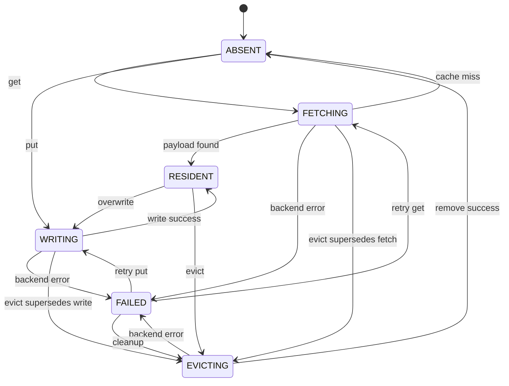

# 异步 KV Cache 传输状态机设计

## 1. 为什么需要传输协调器

分层 KV Cache 不只是调用一次 `remote.get()`。在线服务中，同一个共享前缀可能同时被多个请求命中，传输期间还可能发生请求取消、缓存驱逐、写回失败等事件。如果没有统一协调，会出现以下问题：

1. 多个请求对同一个 KV Page 重复发起 Remote GET，浪费带宽。
2. 任意等待者取消时直接取消共享 Future，导致其他请求也失败。
3. Fetch 与 Evict 并发时，已经被驱逐的数据被晚到的 Fetch 重新标记为 Resident。
4. 后端异常后对象停留在 `FETCHING`，后续请求无法重试。
5. Write、Fetch、Evict 的后端执行顺序与控制面状态顺序不一致。

`AsyncKVTransferCoordinator` 的职责是解决这些控制面一致性问题。它管理字节对象，不负责 CUDA Tensor 序列化、CPU Pinned Memory 或 GPU Stream 调度。

## 2. 状态机



每个 Key 对应一个 `_Entry`，保存：

| 字段 | 作用 |
| --- | --- |
| `state` | 当前状态 |
| `generation` | 逻辑操作版本，防止过期操作发布结果 |
| `payload` | 已驻留的字节对象 |
| `task` | 当前逻辑操作，供并发请求共享 |
| `io_tail` | 该 Key 最后一个后端 I/O，用于串行化冲突操作 |
| `waiters` | 正在共享当前操作的等待者数量 |
| `error` | 最近一次失败的可观测信息 |

## 3. 三个核心机制

### 3.1 Duplicate Fetch Coalescing

第一个请求把状态从 `ABSENT` 改为 `FETCHING`，创建后端读取 Task。后续请求发现同一个 Key 正在 `FETCHING` 时，不再调用后端，而是等待同一个 Task。

```text
request A --+
request B --+--> one backend.get(key) --> shared result
request C --+
```

`backend_gets` 与 `coalesced_gets` 指标分别记录真实后端读取和被合并的读取，可用于验证合并是否生效。

### 3.2 Generation 防止过期结果发布

每次新的 Fetch、Write 或 Evict 都递增 `generation`。异步操作完成时，只有自己的 Generation 仍等于 Entry 当前 Generation，才允许修改状态和 Payload。

例如：

```text
generation 1: Fetch starts
generation 2: Evict supersedes Fetch
generation 1: Fetch finishes, but cannot publish stale payload
generation 2: Remove finishes, state becomes ABSENT
```

这里只使用状态锁并不够。锁可以保证某一瞬间的数据结构修改是原子的，却无法阻止“旧操作晚完成”造成的逻辑覆盖。Generation 解决的是异步操作的时序正确性。

### 3.3 I/O Tail 保证后端顺序

仅阻止旧 Fetch 更新本地状态仍然不够，因为后端调用本身也可能乱序。例如 Evict 先执行 `remove()`，随后旧 Fetch 才从后端读到删除前的数据。

每个 Key 使用 `io_tail` 把冲突后端操作连接成有序链：

```text
Fetch backend.get -> Evict backend.remove -> New Write backend.put
```

新的操作先等待前一个 I/O 完成，再访问后端。不同 Key 之间仍可以并发，不需要一个全局 I/O 串行队列。

## 4. 请求取消隔离

所有调用者通过 `asyncio.shield(task)` 等待内部共享 Task。调用者取消只会结束自己的等待，不会把取消传播给共享 Fetch：

```text
request A cancelled ----X
                         shared Fetch continues --> request B receives KV
request B waiting ------^
```

这对应在线服务中的常见情况：客户端断开连接不应该破坏其他请求正在复用的缓存恢复操作。

## 5. 失败与重试

后端异常会把对象设置为 `FAILED`，清空 Payload，并记录异常类型与消息。下一次 `get()` 可以从 `FAILED` 重新进入 `FETCHING`，不会永久卡住。

失败操作仍保留在 `io_tail` 中。后继操作通过 `gather(..., return_exceptions=True)` 等待它结束并吸收其异常，然后继续新的后端 I/O。因此“前一次失败”不会阻止“后一次重试”。

## 6. 测试覆盖

`tests/test_transfer_coordinator.py` 覆盖：

| 场景 | 验证点 |
| --- | --- |
| 两个并发 Get | 后端只执行一次读取，两个请求得到相同结果 |
| 一个等待者取消 | 共享 Fetch 不被取消，其他等待者正常完成 |
| 后端首次失败 | 状态变为 `FAILED`，下一次 Get 可以成功重试 |
| Fetch 与 Evict 竞争 | 旧 Fetch 返回值失效，Remove 按顺序执行，最终为 `ABSENT` |
| Get 命中进行中的 Write | 不额外读取后端，直接共享 Write 结果 |

这些测试使用可阻塞的 Fake Backend 主动构造时序，不依赖网络速度碰运气触发 Race。

## 7. 当前边界

当前实现解决的是 Remote KV 对象操作的控制面并发问题，还没有完成以下数据面工作：

1. 从 nano-vLLM 每层 K/V Tensor 中提取指定 Page。
2. 定义跨进程稳定的 Tensor Layout 与序列化格式。
3. 使用 Pinned Memory 和独立 CUDA Stream 执行 CPU/GPU 异步拷贝。
4. Fetch 完成后把物理 Block 注册回 `BlockManager` 并唤醒 Scheduler。
5. 在 Request Cancellation 时同时维护 Sequence、Block Refcount 与 Transfer Waiter 生命周期。

下一阶段接入真实数据面时，应保持本状态机作为传输协调层，而不是让 Scheduler 直接调用 Mooncake API。这样 Scheduler 只处理请求可运行状态，存储错误、重复请求和 I/O 顺序由协调器统一管理。
