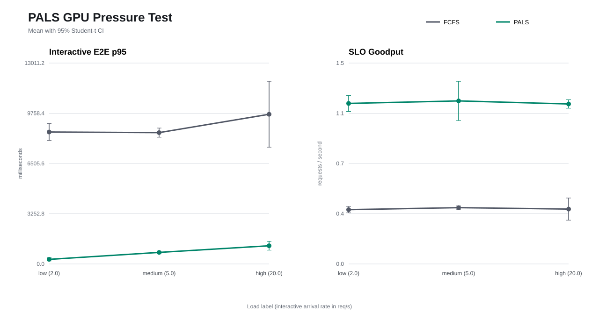

# 真实 GPU Serving Benchmark 与 Ablation

## 1. 为什么需要这套实验

控制面模拟适合验证 Scheduler 决策和成本模型，但不能回答真实 GPU 上的延迟与吞吐。
本实验直接调用 nano-vLLM 的 OpenAI 兼容 API，并使用引擎内部时间戳统计指标，避免把
浏览器渲染、网络抖动或客户端线程调度误算成模型执行时间。

每轮实验同时保存：

- TTFT、TPOT、E2E 和 Queue Latency 的 p50/p95/p99；
- 请求吞吐、输出 Token 吞吐、SLO 达成率和 SLO Goodput；
- Prefix Cache 查询块、命中块、淘汰块和本轮命中率；
- Mooncake GET/PUT 次数、传输字节、恢复 Token 和失败数；
- 每个请求的类别、优先级、到达时间、Token 数、抢占次数和 SLO 结果。

## 2. 已验证环境

- GPU：NVIDIA GeForce RTX 4060 Laptop GPU，8 GiB
- 模型：Qwen3-0.6B，BF16
- 系统：Windows 11 + WSL2 Ubuntu-22.04
- CUDA 主路径：Triton + FlashAttention
- KV Page：256 Token
- 调度实验：4 个 Batch 请求、4 个 Interactive 请求
- Batch 输出上限：64 Token
- Interactive 输出上限：4 Token
- Interactive 到达间隔：100 ms
- Prefix：32 段固定文本，实验前执行一次 Warmup

调度实验使用 `max_num_seqs=1`，目的是让不同策略对同一 GPU 执行槽的选择可观察。
这不是正常聊天服务的推荐配置；正常服务保持默认 `64` 以启用 Continuous Batching。

## 3. 运行 FCFS 基线

先保持 Mooncake 关闭，避免远端恢复成为额外变量：

```bash
cd /mnt/d/nano-vllm-qos
SCHEDULING_POLICY=fcfs \
PREFIX_CACHE_BACKEND=radix \
MAX_NUM_SEQS=1 \
ENABLE_MOONCAKE=0 \
bash scripts/run_nanovllm_wsl.sh
```

在另一个终端运行：

```bash
python -m benchmarks.benchmark_serving_gpu \
  --hardware "NVIDIA GeForce RTX 4060 Laptop GPU 8GB" \
  --workload-id rtx4060-scheduler-v1 \
  --batch-requests 4 \
  --interactive-requests 4 \
  --shared-prefix-repeats 32 \
  --batch-output-tokens 64 \
  --interactive-output-tokens 4 \
  --output-json benchmarks/results/serving_gpu_fcfs_radix_local_scheduler.json
```

## 4. 运行 PALS 候选策略

停止 FCFS Worker，只改变调度策略：

```bash
SCHEDULING_POLICY=pals \
PREFIX_CACHE_BACKEND=radix \
MAX_NUM_SEQS=1 \
ENABLE_MOONCAKE=0 \
bash scripts/run_nanovllm_wsl.sh
```

再次运行完全相同的 Benchmark 命令，仅修改输出文件名：

```bash
python -m benchmarks.benchmark_serving_gpu \
  --hardware "NVIDIA GeForce RTX 4060 Laptop GPU 8GB" \
  --workload-id rtx4060-scheduler-v1 \
  --batch-requests 4 \
  --interactive-requests 4 \
  --shared-prefix-repeats 32 \
  --batch-output-tokens 64 \
  --interactive-output-tokens 4 \
  --output-json benchmarks/results/serving_gpu_pals_radix_local_scheduler.json
```

`workload-id` 必须保持一致，否则两组 Prompt 不同，不能构成控制变量实验。

## 5. 自动生成对比报告

```bash
python -m benchmarks.compare_serving_runs \
  --baseline benchmarks/results/serving_gpu_fcfs_radix_local_scheduler.json \
  --candidate benchmarks/results/serving_gpu_pals_radix_local_scheduler.json \
  --output-json benchmarks/results/serving_gpu_scheduler_comparison.json \
  --output-markdown benchmarks/results/serving_gpu_scheduler_comparison.md
```

当前小样本结果：

| 指标 | FCFS | PALS | 变化 |
| --- | ---: | ---: | ---: |
| 请求吞吐 | 0.783 req/s | 0.780 req/s | -0.4% |
| SLO Goodput | 0.392 req/s | 0.780 req/s | +99.2% |
| Interactive TTFT p95 | 76.52 ms | 504.78 ms | +559.7% |
| Interactive E2E p95 | 8963.88 ms | 591.08 ms | -93.4% |
| Batch TTFT p95 | 143.85 ms | 2731.30 ms | +1798.7% |
| Batch E2E p95 | 8678.68 ms | 9375.08 ms | +8.0% |

FCFS 会较早完成各请求 Prefill，因此 Interactive TTFT 较低；但在单执行槽下，后续
Decode 长时间被 Batch 请求占用，Interactive E2E SLO 全部失败。PALS 重新分配 Decode
机会，使 Interactive E2E 显著下降并达到 SLO，代价是 Batch 和首 Token 延迟增加。
这说明优化目标不是让每个指标同时变小，而是在几乎不损失吞吐的情况下提高关键请求
的 SLO Goodput。

## 6. 一键运行重复 Ablation

脚本会在每轮之间停止并重启 Worker、校验实际 Policy/Prefix/Backend，完成后恢复
PALS + Radix + Mooncake 聊天服务。默认重复 3 轮：

```bash
cd /mnt/d/nano-vllm-qos
REPEATS=3 bash scripts/run_gpu_ablation_wsl.sh prefix
REPEATS=3 bash scripts/run_gpu_ablation_wsl.sh remote
```

`aggregate_serving_runs` 会拒绝混合模型、硬件、工作负载指纹、Warmup 状态或决策模式不同
的样本，并输出 Mean、Sample Standard Deviation 与 Student-t 95% CI。原始逐请求 CSV、
每轮 JSON 以及聚合 Markdown 位于 `benchmarks/results/repeated`。

实验矩阵逐项改变一个变量：

| 组别 | Policy | Prefix | Remote KV | 目的 |
| --- | --- | --- | --- | --- |
| A | FCFS | Radix | 关闭 | 调度基线 |
| B | PALS | Radix | 关闭 | 调度 Ablation |
| C | PALS | Hash | 关闭 | Hash/Radix 对照 |
| D | PALS | Radix | Mooncake | Remote KV 对照 |

测量远端恢复时使用 `--no-warmup`。脚本先在 D 组写回固定 Prefix，只重启 GPU Worker，
再用相同 `workload-id` 发起请求。Restore Worker 使用
`--remote-kv-force-restore` 隔离并测量数据路径；正常服务不启用该参数，仍由 Cost-Aware
Planner 在 Restore 与 Recompute 之间选择。

## 7. 三轮实机结果

所有数值为 `Mean +/- 95% CI Half Width`。

### Hash 与 Radix

| 指标 | Hash | Radix | 均值变化 |
| --- | ---: | ---: | ---: |
| Prefix Block Hit Rate | 100% | 100% | 0% |
| 请求吞吐 | 9.932 +/- 0.882 req/s | 7.439 +/- 4.475 req/s | -25.1% |
| Batch E2E p95 | 568.404 +/- 23.400 ms | 614.809 +/- 98.495 ms | +8.2% |

两组都正确复用了相同的 24 个 Block。Radix 的方差较大且置信区间与 Hash 重叠，因此这
3 轮数据只能证明实现语义正确，不能证明某一索引在该短 Prefix、小样本下更快。Radix 的
工程价值主要是层次化最长前缀匹配、分支共享和后续分层缓存扩展能力。

### Local Recompute 与 Mooncake Restore

| 指标 | Local | Mooncake Forced Restore | 均值变化 |
| --- | ---: | ---: | ---: |
| TTFT | 1076.003 +/- 75.359 ms | 2027.055 +/- 284.708 ms | +88.4% |
| E2E | 1999.753 +/- 291.177 ms | 3007.438 +/- 711.927 ms | +50.4% |
| 请求吞吐 | 0.494 +/- 0.073 req/s | 0.330 +/- 0.072 req/s | -33.2% |
| Remote GET | 0 Bytes | 117,441,336 Bytes | 每轮一致 |
| Restored Token | 0 | 1024 | 每轮一致 |
| Restore Completed | 0 | 1 | 每轮一致 |

Mooncake 在 3 轮中都完成了跨 Worker KV 恢复，证明 Catalog、GET、CPU Buffer、GPU Import、
BlockManager 原子提交和 Scheduler 唤醒闭环有效。但 Qwen3-0.6B 的本地 Prefill 较轻，
而 WSL2 单机 TCP 需要搬运约 112 MiB，所以强制恢复更慢。默认 Cost-Aware Planner 选择
Recompute 是符合实测结果的；未来 RDMA、多机或更大模型/更长 Prefix 才是 Remote KV
更可能产生收益的场景。

## 8. 实验中发现并修复的问题

第一次跨 Worker 实验只有约 112 MiB PUT，没有 GET，也没有 Restored Token。排除成本模型
后定位到 Mooncake Catalog 使用固定对象 Key：KV Page 是内容寻址的不可变对象，可以
使用 Insert；Catalog 是持续变化的元数据，必须使用 Upsert。旧实现再次 `put` 后，新
Worker 仍读取旧 Catalog 快照。

修复后为存储接口增加显式 `upsert`，Mooncake 通过 `upsert_batch` 更新 Catalog，同时保留
KV Page 的普通 `put` 路径。回归测试模拟“put 只插入、upsert 才覆盖”的 Backend；真实 GPU
实验进一步验证每轮 `remote_restore_started=1`、`remote_restore_completed=1`、
`kv_restored_tokens=1024`。

## 9. 如何形成可信简历结论

当前结果已经包含 3 轮重复和置信区间，但样本数仍少。后续正式报告应继续满足：

1. 每组至少重复 5 到 10 次，报告均值、标准差或置信区间；
2. 在低、中、高三个请求到达率下重复；
3. 固定模型、GPU、输出长度、Prompt 分布、Warmup 和缓存初始状态；
4. 同时报告收益与代价，不只选择改善的指标；
5. 将模拟结果、单机 TCP 结果和未来 RDMA/多机结果明确分开。

简历可写“构建可复现的 GPU Ablation 框架，使用工作负载指纹和 Student-t 95% CI 控制
实验可比性；定位并修复 Mooncake 可变 Catalog 的 Insert/Upsert 语义错误，在 3 轮跨
Worker 实验中稳定恢复 1024 Token”。同时应明确单机 TCP Restore 在当前工作负载更慢，
不要把功能闭环包装成不存在的性能提升。

## 10. 多到达率 PALS 压力实验

运行命令：

```bash
cd /mnt/d/nano-vllm-qos
REPEATS=3 bash scripts/run_gpu_ablation_wsl.sh pressure
```

脚本固定 Qwen3-0.6B、RTX 4060 Laptop GPU、Radix、`max_num_seqs=1`、4 个 Batch 请求、
8 个 Interactive 请求和输出长度，只修改交互请求到达间隔：

| 档位 | 到达间隔 | 到达率 |
| --- | ---: | ---: |
| Low | 500 ms | 2 req/s |
| Medium | 200 ms | 5 req/s |
| High | 50 ms | 20 req/s |

三轮结果为 `Mean +/- 95% CI Half Width`：

| 到达率 | FCFS E2E p95 | PALS E2E p95 | 降低 | FCFS/PALS SLO | 吞吐变化 |
| ---: | ---: | ---: | ---: | ---: | ---: |
| 2 req/s | 8545 +/- 545 ms | 298 +/- 106 ms | 96.5% | 0% / 100% | -1.4% |
| 5 req/s | 8505 +/- 298 ms | 746 +/- 69 ms | 91.2% | 0% / 100% | -3.5% |
| 20 req/s | 9695 +/- 2133 ms | 1178 +/- 284 ms | 87.9% | 0% / 100% | -2.8% |

三档 GPU 平均利用率约为 31% 到 35%，FCFS/PALS 峰值显存均约 6.3 GiB。PALS 的 Batch
TTFT 和 E2E 会增加，但 Batch 仍满足本实验的 30 秒 E2E SLO。这体现了调度器真正的优化
目标：以可控的 Batch 延迟换取交互请求尾延迟和整体 SLO Goodput，而不是声称所有指标
都会同时改善。


