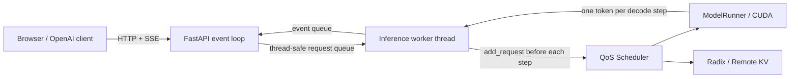

# OpenAI 兼容服务与流式前端设计

## 1. 这部分解决什么问题

原始 nano-vLLM 的 `generate()` 是同步 Python 接口：调用者提交一组 Prompt，然后一直等待
整条回复生成完毕。它适合脚本验证，但还不是一个在线推理服务，因为浏览器无法逐 Token
看到结果，多个 HTTP 请求也不能自然地进入同一个 Continuous Batching 调度循环。

本项目增加了三层能力：

1. 引擎层暴露每个 Step 新生成的 Token，并支持取消请求；
2. 服务层提供 OpenAI 风格 Chat Completions API 和 SSE 流；
3. 前端层展示真实对话、TTFT/E2E、Token 用量、调度队列和缓存指标。

这不是把 `generate()` 简单包进一个 HTTP Handler。关键约束是：CUDA 上下文和模型执行必须
留在固定线程中，而 Web 层还要并发接收新连接、处理断开并及时向客户端推送增量结果。

## 2. 整体架构



### 为什么必须有独立推理线程

如果每个 FastAPI 请求都直接在线程池调用 `engine.step()`，会出现三个问题：

- 多个线程可能同时访问一个 Scheduler 和 BlockManager，破坏队列与 KV Block 所有权；
- CUDA 上下文和通信操作分散到不同线程，初始化与执行顺序难以保证；
- 每个请求各自循环 `step()`，Continuous Batching 反而被拆散。

`InferenceWorker` 因此在自己的线程中创建 Engine，后续的 `add_request()`、`step()`、
`cancel_request()`、指标读取和 `exit()` 全在同一线程执行。FastAPI 与它只通过线程安全队列通信。

## 3. 一个请求如何流过系统

1. FastAPI 使用 Pydantic 校验 `model`、`messages`、采样参数和 QoS 字段。
2. Worker 用模型 Tokenizer 的 `apply_chat_template()` 把多轮消息转换为 Prompt Token IDs。
3. Worker 在下一次 Engine Step 前调用 `add_request()`，多个同时到达的 HTTP 请求因此能进入同一批次。
4. Prefill 或 Decode 完成后，`LLMEngine.step()` 比较处理前后的 Completion Token 数量。
5. 新 Token 被记录为 `(seq_id, token_id)` 事件，但原来的 `step()` 最终输出格式保持不变。
6. Worker 累积 Token IDs，通过 Tokenizer 解码稳定文本前缀，再向对应连接发送 `TextDelta`。
7. 请求结束后发送完整文本、Usage、请求级延迟和 KV 恢复指标。

解码时不能只对单个 Token 调用 `decode()` 后直接拼接，因为 BPE Token、字节 Token 和 Unicode
边界可能跨 Token。实现会对累计 Token IDs 解码，只发布相对上一次稳定文本前缀新增的部分，
并暂缓包含 Unicode Replacement Character 的尾部。

## 4. SSE 协议顺序

流式响应遵循如下顺序：

```text
role chunk
content delta chunk 1
content delta chunk 2
...
finish_reason chunk
usage chunk             # 仅 stream_options.include_usage=true
data: [DONE]
```

一个 Content Chunk 的核心结构如下：

```json
{
  "id": "chatcmpl-nv-...",
  "object": "chat.completion.chunk",
  "model": "qwen3-0.6b",
  "choices": [
    {"index": 0, "delta": {"content": "新增文本"}, "finish_reason": null}
  ]
}
```

`x_nanovllm_metrics` 是本项目扩展字段，用于把请求级 TTFT、TPOT、E2E、抢占次数和 Remote KV
恢复数据传给前端。不了解该字段的标准客户端可以直接忽略它。

## 5. 取消为什么不能只关闭 HTTP

浏览器点击停止或连接断开后，如果只结束 SSE Generator，GPU 上的请求仍会继续生成并占用 KV
Cache。当前取消链路会根据请求所在状态分别处理：

- `WAITING`：从等待队列移除；
- `RUNNING`：从运行队列移除并释放 Block Table；
- `WAITING_FOR_KV`：取消 Remote Restore Waiter，回收预留 Physical Block；
- 已结束或不存在：返回 `False`，不重复计数。

取消请求不会进入正常 Completion 指标，因为它可能还没有 First Token，强行调用完整指标计算会产生
错误语义。Scheduler 单独维护 `cancelled_requests`。

## 6. 运行与验证

真实模型服务：

```bash
python -m pip install -e ".[serve]"
python -m nanovllm.serve \
  --model /path/to/Qwen3-0.6B \
  --served-model-name qwen3-0.6b \
  --scheduling-policy pals \
  --prefix-cache-backend radix
```

无 GPU 的 API/UI 开发模式：

```bash
python -m pip install -r requirements-control.txt
python -m nanovllm.serve --mock --port 8010
```

自动化测试：

```bash
python -m pytest -q tests/test_openai_serving.py tests/test_serving_worker.py
```

测试覆盖普通响应、SSE Chunk 顺序、Usage、错误结构、API Key、并发请求推进和主动取消。Mock
后端只用于开发与 CI，不能作为模型正确性或性能结果。

## 7. 面试时可以怎样解释

可以把难点概括为：

> 我没有直接在 FastAPI Handler 里调用同步 `generate()`，因为那样会阻塞事件循环，也会拆散
> Continuous Batching。我增加了独占 CUDA 的推理线程和双向事件队列，在每个 Engine Step 前批量
> 接纳新请求，并从 Decode Step 提取真实 Token 事件。客户端断开时还要跨 Waiting、Running 和
> Remote Restore 三种状态回收 KV Block，避免请求已经消失但显存继续被占用。

这段工作能够同时落到 API 协议、并发模型、Scheduler 状态机、KV Cache 生命周期、可观测性和前端
体验，不是单纯复现上游 Demo。

## 8. 当前边界

- 当前只实现纯文本 Chat Completions，不支持多模态、Tool Calling、Logprobs、`top_p != 1`、
  Stop Sequence 和 `n > 1`；
- 一个服务进程对应一个 Engine，横向扩容仍需要外部 Router；
- API Key 是单 Key 本地保护，不是完整租户鉴权和限流系统；
- 生产压测、断连风暴、慢客户端 Backpressure 和多副本指标聚合仍需继续补充；
- Mock 页面只能证明协议和交互链路，真实 TTFT/TPOT 必须在固定 GPU、模型和负载下测量。
