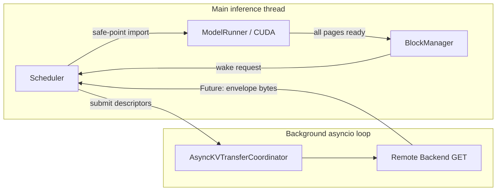

# Remote KV Restore 与 Scheduler 唤醒闭环

## 1. 目标

此前项目已经具备 Remote Prefix Metadata、Transfer-vs-Recompute Cost Model、异步对象读取和真实 KV Page 恢复原语，但这些模块尚未连接到推理请求生命周期。本阶段完成以下闭环：

```text
Remote Prefix Match
-> Cost Model
-> Reserve Physical Blocks
-> WAITING_FOR_KV
-> Background GET
-> Main-thread GPU Import
-> Atomic Local Radix Commit
-> Scheduler Wakeup
-> Prefill Remaining Suffix
```

实现后，Remote Cache Hit 不再只是 Benchmark 中的规划结果，而会真实改变 `Sequence` 的调度状态与 `num_cached_tokens`。

## 2. 为什么增加 WAITING_FOR_KV

原始 nano-vLLM 只有三种状态：

```text
WAITING -> RUNNING -> FINISHED
```

Remote KV 恢复期间，请求已经拥有部分 Physical Block，但这些 Block 尚未包含可用数据。此时请求既不能继续 Prefill，也不应该进入 Running Queue。因此新增：

```text
WAITING -> WAITING_FOR_KV -> WAITING -> RUNNING
```

如果恢复失败：

```text
WAITING_FOR_KV
-> release reserved blocks
-> mark restore attempted
-> WAITING
-> local Prefill fallback
```

`remote_restore_attempted` 防止同一个请求在失败后反复命中同一坏对象，形成无限重试循环。

## 3. 线程与 CUDA 的职责隔离

nano-vLLM 的公开 `generate()` 是同步 API，而远端 I/O 应该异步执行。项目没有把整个推理引擎强行改成 Async API，而是使用两部分：



后台线程只处理普通字节对象，绝不访问 CUDA Tensor。`ModelRunner.import_kv_page()` 始终由主推理线程调用，避免 CUDA Context、Current Stream 与线程局部状态混乱。

## 4. Remote Prefix Catalog

`RemotePrefixCatalog` 使用独立的 Page-Aligned Radix Tree：

```text
Token Block Path -> RemotePageDescriptor
```

Descriptor 保存：

- Object Key
- Model Identity Digest
- TP Rank
- Logical Page Index

Catalog 只发布已经成功写入 Backend 的 Prefix。重复注册同一 Token Prefix 时保留第一条 Canonical Path，避免多个对象描述争夺同一逻辑前缀。

当前 Catalog 位于内存中。真实服务重启后的 Catalog 重建、持久化和多实例一致性仍属于后续工作。

## 5. 调度步骤

### 5.1 Local Match 优先

Scheduler 先执行原有 Local Hash/Radix Match，得到 `local_cached_blocks`。只有 Remote Prefix 比 Local Prefix 更长时，才可能恢复：

```text
remote_cached_blocks > local_cached_blocks
```

### 5.2 Cost Model 决策

Remote Match 会交给已有 `KVTransferPlanner`：

```text
min(local recompute, Mooncake restore + suffix recompute)
```

如果远端带宽过低、固定延迟过高或 Prefix 太短，请求保持原有本地 Prefill 路径，不进入 `WAITING_FOR_KV`。

### 5.3 预留 Physical Block

决定恢复后，`BlockManager.reserve_restore()` 一次性构建完整 Block Table：

- Local Hit 部分增加 Refcount。
- Remote Restore 部分分配新的 Physical Block。
- 未命中后缀和后续 Decode 保留可写 Block。

容量不足时不会进行部分预留，也不会发起 Remote GET。

### 5.4 异步读取与请求合并

`RemoteKVRestoreService` 在后台 Event Loop 中调用现有 `AsyncKVTransferCoordinator`。两个请求命中相同 Remote Page 时：

```text
request A --+
             +-> one Backend GET -> two Futures
request B --+
```

任一请求取消只取消自己的 Future，不会取消共享 Backend Fetch。

### 5.5 主线程恢复与原子发布

所有 Envelope 到达后，`LLMEngine` 在下一次调度安全点逐 Page 调用：

```python
ModelRunner.import_kv_page(
    physical_block_id,
    envelope,
    identity_digest,
    logical_page_index,
)
```

只有所有 Page 都通过 Identity、TP Rank、Layout 与 Checksum 校验并成功写入 GPU 后，`BlockManager.commit_restored_prefix()` 才会把 Prefix 插入本地 Radix Tree。

因此其他请求无法命中“只恢复了一半”的 Prefix。

## 6. 失败处理

以下错误统一回退本地 Prefill：

- Remote Object 缺失。
- Backend GET 异常。
- Envelope Checksum 损坏。
- Model Identity、TP Rank 或 Layout 不匹配。
- GPU Page Import 失败。

处理顺序：

```text
cancel remaining waiters
-> deallocate reserved block table
-> record error and restore wait
-> requeue at Waiting head
-> bypass remote on next schedule
```

多 Page Fetch 中任意一页失败时立即进入失败处理，不等待其他慢页全部结束。底层共享 I/O 仍可继续服务其他请求。

## 7. 新增观测指标

请求级：

- `kv_restore_wait_ms`
- `kv_restored_tokens`
- `kv_restore_failures`
- `remote_restore_error`

Scheduler 级：

- `remote_restore_started`
- `remote_restore_completed`
- `remote_restore_failed`
- `remote_restore_pending`

Remote I/O 级：

- Backend GET/PUT/REMOVE 次数
- Coalesced GET 次数
- Cancelled Waiter 数量
- Backend Failure 数量

## 8. 测试覆盖

`tests/test_remote_restore.py` 使用 Fake Backend 主动构造时序，覆盖：

1. Duplicate Prefix 注册保持 Canonical Descriptor。
2. 成功恢复后原子注册 Local Radix 并只 Prefill 剩余 Token。
3. 缺页后释放所有 Block 并回退本地 Prefill。
4. 两个请求共享同一组 Remote GET。
5. Cost Model 拒绝高成本远端命中。
6. 多 Page 中一页缺失时 Fail-Fast。
7. 请求取消不破坏共享 Fetch。
8. 容量不足时不预留部分 Block、不发起读取。

## 9. 当前边界

本阶段完成的是 **TP=1 下的自动 Remote Restore**。仍需继续：

1. 在本地 Prefix 变为可缓存后自动异步 Write-Back，而不是手工注册 Catalog。
2. 持久化 Remote Prefix Catalog，并支持服务重启与多实例一致性。
3. TP>1 时每个 Rank 独立恢复自己的 KV Shard，并进行完成 Barrier。
4. 独立 CUDA Stream/Event，让 Page Import 与其他请求计算重叠。
5. 真实 Mooncake 进程端到端测试与 GPU 性能测量。
