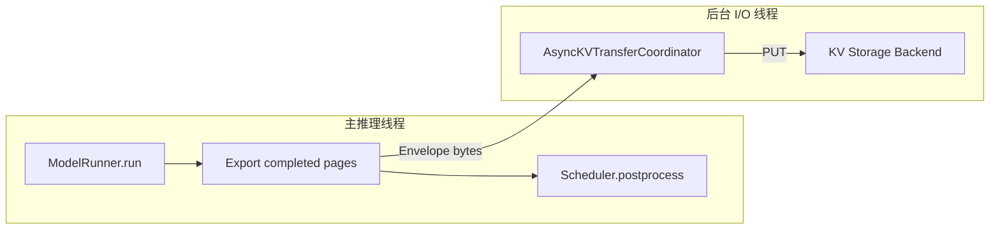

# 自动 Remote KV Write-Back 设计

## 1. 这一阶段解决什么问题

此前的自动 Remote Restore 已经能读取远端 KV Page，但远端对象仍需要手工注册。完整的
缓存闭环还缺少生产者路径：本地 Prefill 或 Decode 产生新的完整 Page 后，引擎应自动把它
写入远端，使后续请求能够跨本地 GPU Cache 生命周期复用该前缀。

本阶段形成以下闭环：

```text
ModelRunner.run
-> detect newly completed pages
-> main-thread GPU page export
-> background backend PUT
-> all pages succeed
-> atomic RemotePrefixCatalog publish
-> later request can plan remote restore
```

当前编排限定 `tensor_parallel_size=1`。真实 Tensor Page 导出原语已通过 CUDA 往返测试，
写回并发与失败语义由 Fake Backend 单测覆盖；真实 Mooncake 进程的端到端性能仍待测量。

## 2. 最关键的安全点

写回不能在任意时刻读取 Physical Block。一次引擎 Step 的关键顺序是：

```text
ModelRunner.run(seqs)
LLMEngine._enqueue_remote_writebacks(seqs)  <- Export 放在这里
Scheduler.postprocess(seqs, token_ids)
```

`run()` 返回时，Attention 已把本轮 K/V 写入对应 Block；`postprocess()` 则可能因为请求生成
EOS 或达到 `max_tokens` 而立刻调用 `BlockManager.deallocate()`。如果在 Postprocess 之后
导出，原 Block 可能已经进入 Free List，甚至被另一个请求复用。

因此 GPU Page 必须在二者之间同步打包。只有普通 Bytes Envelope 离开 CUDA 所有权边界后，
后台线程才能安全执行远端 PUT。

## 3. 如何判断“新完成 Page”

引擎复用 `BlockManager.hash_blocks()` 的页边界公式：

```text
start = num_cached_tokens // block_size
end   = (num_cached_tokens + num_scheduled_tokens) // block_size
```

只有 `end > start`，本轮才真正填满了新 Page。这个判断对 Chunked Prefill 和 Decode 都成立：

- 未跨 Page 边界：不创建写回批次；
- 跨过一个或多个边界：写回到 `end` 为止的完整前缀；
- 不写最后一个未填满 Page，避免缓存不可复用的部分状态。

`remote_kv_min_prefix_blocks` 可以设置最短写回前缀，减少短前缀的固定 I/O 开销；默认值为 1。
`remote_kv_writeback=False` 可以关闭自动写回。

## 4. 为什么 Export 同步、PUT 异步

`ModelRunner.export_kv_page()` 访问 CUDA Tensor 和当前推理 Stream，应由主推理线程调用。
导出的 Envelope 已经是带版本、模型身份、布局与 Checksum 的 Bytes，可以交给
`RemoteKVRestoreService` 的独立 asyncio Event Loop：



这样远端网络或存储延迟不会直接阻塞当前请求的 Token 生成。不过当前 Export 本身仍是同步
操作，因此传输与 CUDA 计算完全重叠还需要后续的独立 CUDA Stream/Event。

## 5. 并发去重与前缀扩展

`RemoteKVRestoreService` 维护：

```text
object_key -> in-flight Future
```

两个请求同时完成相同前缀时，第二个批次复用第一个批次的 Future，不再 Export 或 PUT 同一
Page。前缀逐页增长时也可以复用：

```text
batch A: page-0 is writing
batch B: page-0 + page-1
         reuse page-0 Future, only export/write page-1
```

对象 Key 包含模型身份、TP Rank、逻辑 Page Index 和累计 Token Prefix Digest，所以只会合并
语义相同的 Page。

## 6. 为什么 Catalog 必须最后发布

远端 Catalog 是恢复路径的可见性入口。如果先发布两页 Prefix，再写 Page，另一个请求可能
立即命中 Catalog，却在 Backend 只读到一页。当前实现采用批次提交：

```text
all PUT Futures succeed -> catalog.register(full_prefix)
any PUT fails           -> do not publish this prefix
```

因此 Catalog 不会暴露部分写入。多个批次共享 Future 时，每个批次仍独立判断自己的完整
前缀是否满足发布条件。

## 7. 失败隔离与退出语义

Write-Back 是性能优化，不是生成正确性的依赖：

- GPU Export 失败：记录错误，继续正常 Postprocess；
- Backend PUT 失败：批次不发布 Catalog，生成结果不受影响；
- 多 Page 中一页失败：快速标记该批次失败，不等待慢页后再决定；
- 引擎退出：等待 Pending Write-Back 完成，再关闭 Backend 和 ModelRunner。

这与 Remote Restore 的失败策略不同。Restore 失败需要释放预留 Block 并回退 Prefill；
Write-Back 失败时本地计算已经成功，只是失去未来的远端复用机会。

## 8. 可观测指标

`RemoteKVRestoreService.metrics()` 新增：

- `writeback_submitted`：创建的写回批次数；
- `writeback_completed`：成功发布 Catalog 的批次数；
- `writeback_failed`：后台写入失败批次数；
- `writeback_export_failed`：Export 或提交阶段失败次数；
- `writeback_pages`：实际新发起 PUT 的 Page 数；
- `writeback_coalesced_pages`：复用在途 PUT 的 Page 次数。

底层原有 `backend_puts`、`failures` 等指标仍可用于区分批次语义与实际 Backend I/O。

## 9. 测试覆盖与当前边界

`tests/test_remote_writeback.py` 覆盖：

1. 只有跨 Page 边界时才触发候选写回；
2. PUT 全部成功后才发布 Catalog；
3. 某一 Page 写入失败时不暴露部分 Prefix；
4. 两个并发批次合并重复 PUT；
5. 更长 Prefix 复用正在写入的较短 Prefix。

仍需继续完成：

1. 基于 Backend CAS 或事务元数据的多实例 Catalog 一致性；
2. TP>1 下各 Rank 的 Shard Write-Back 和完成 Barrier；
3. 独立 CUDA Stream/Event 与异步 D2H Pipeline；
4. 真实 Mooncake TCP/RDMA 环境下的 TTFT、带宽、命中率和重计算 Token 对比。

单写者 Catalog 持久化和服务重启重建已经实现，详见
[Remote Catalog 持久化设计](persistent_catalog_zh.md)。
