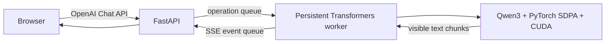

# Windows 本地运行真实 Qwen3 模型

## 1. 当前使用的模型

本机下载的是官方对话模型
[Qwen/Qwen3-0.6B](https://huggingface.co/Qwen/Qwen3-0.6B)，不是 Base 模型，也不是
GGUF 或第三方量化版本。

```text
本地目录：D:\models\Qwen3-0.6B
Revision：c1899de289a04d12100db370d81485cdf75e47ca
Architecture：Qwen3ForCausalLM
Layers：28
Hidden size：1024
Attention heads：16
KV heads：8
DType：BF16
Safetensors：311 个张量
```

权重文件的校验结果：

```text
model.safetensors bytes:
1503300328

SHA-256:
f47f71177f32bcd101b7573ec9171e6a57f4f4d31148d38e382306f42996874b
```

SHA-256 与模型托管站返回的官方 ETag 完全一致。模型目录放在代码仓库之外，因此不会被 Git
误提交。

## 2. 为什么不是直接启动 nano-vLLM

本项目的 nano-vLLM 模型路径依赖 Triton Kernel 和 FlashAttention。当前 Windows 原生
Python 环境中：

- PyPI 没有可安装的官方 Windows Triton Wheel；
- FlashAttention 只能尝试本地源码构建；
- 当前机器没有 WSL2 Linux 环境。

因此直接声称 Windows 上运行的是 nano-vLLM CUDA 后端并不准确。本项目保留 Linux 上的
nano-vLLM 主路径，同时增加 `scripts/serve_transformers_windows.py` 作为兼容入口。

```text
Qwen3 权重                  同一份
Tokenizer / Chat Template   同一份
对话前端与 OpenAI API       同一套
模型执行                    Transformers + SDPA
请求执行                    单线程 FCFS
```

兼容后端不会伪造以下指标：

- Continuous Batching；
- Paged KV Cache；
- Radix Prefix Cache；
- Mooncake Remote KV；
- PALS QoS 调度。

页面顶部会显示 `Transformers CUDA compatibility`，Prefix Cache 显示 `unavailable`，
QoS 优先级控件也会自动隐藏。

## 3. 安装环境

先安装与你的显卡驱动匹配的 PyTorch CUDA Wheel，再安装其余依赖：

```powershell
python -m pip install torch==2.8.0 `
  --index-url https://download.pytorch.org/whl/cu129

python -m pip install -r requirements-transformers-windows.txt
```

本机验证环境：

```text
GPU：NVIDIA GeForce RTX 4060 8GB
PyTorch：2.8.0+cu129
Transformers：4.57.6
Attention：PyTorch SDPA
模型显存：约 1.15GB（不含其他进程和生成时缓存）
```

## 4. 启动真实模型

```powershell
D:\Python\3.9\python.exe scripts\serve_transformers_windows.py `
  --model D:\models\Qwen3-0.6B `
  --served-model-name Qwen3-0.6B `
  --port 8011
```

浏览器打开：

```text
http://127.0.0.1:8011/
```

需要思考模式时增加 `--enable-thinking`。默认关闭思考模式，适合本地普通对话，回复速度更快，
也不会把 `<think>...</think>` 过程默认加入历史记录。

## 5. 请求执行链路



模型加载、Prompt Tensor 搬运和 `model.generate()` 都发生在同一个持久 Worker 线程中。
FastAPI 线程不直接操作 CUDA。多个请求按照 FCFS 排队；SSE 客户端断开时会设置取消事件，
`StoppingCriteria` 在下一次生成迭代中终止模型。

## 6. 实测结果

本机对真实接口进行过流式和非流式验证：

```text
Prompt：请用一句中文介绍你自己，并说明你现在运行在本地。
Reply：我是一个基于现代AI技术创建的助手，目前运行在本地服务器上……
Prompt tokens：25
Completion tokens：28
TTFT：约 232 ms
E2E：约 2.0 s
```

这些数字只表示当次本机功能验证，不是正式 Benchmark。显卡同时运行其他服务、Prompt 长度、
生成长度和采样都会改变结果。

## 7. 后续如何回到真正的 nano-vLLM

要验证本项目核心的 Continuous Batching、PALS、Radix Cache 与 Remote KV，需要在
Linux/WSL2 CUDA 环境中安装 Triton 和 FlashAttention，然后使用主服务入口：

```bash
python -m nanovllm.serve \
  --model /path/to/Qwen3-0.6B \
  --served-model-name Qwen3-0.6B \
  --scheduling-policy pals \
  --prefix-cache-backend radix
```

Windows Transformers 后端解决的是“本机真实模型对话与前端联调”，Linux nano-vLLM 后端解决的
才是“推理引擎调度与 KV Cache 优化验证”。两者边界必须在项目介绍和简历中保持清楚。
